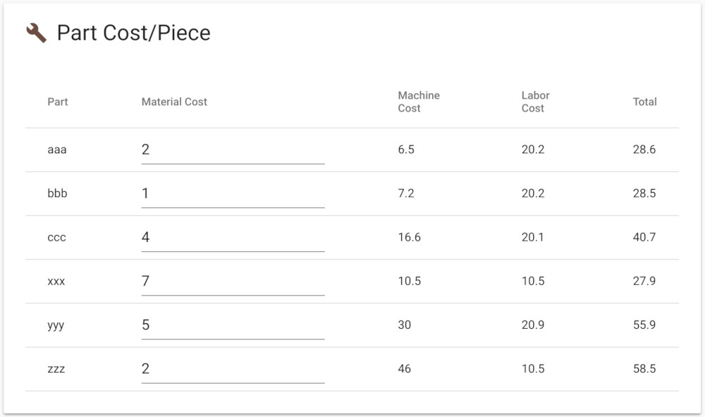

Cost-per-piece is a great [actionable insight](improve-fms.md) for scheduling, operations
management, future capital purchases, quoting work, accounting, and
budgeting. The cost/piece tab is largely intended to serve as a
verification that flexibility and operational changes are reducing part
costs; you can compare part costs from before a change to after a change to
understand if the change improved the system.
Indeed, FMS Insight has a narrow view of just the cell itself and does not
take into account any overhead or other costs. Therefore, for budgeting,
quoting work, and other management decisions, we suggest that you [export the
workorder data](workorder-report.md) to your ERP and implement a cost report
in your ERP taking into account all factors.

Cost/piece is not a great metric for improving the cell's operations since
focusing only on cost/piece risks introducing quality problems and OEE
reduction when shared costs are not correctly accounted.  Instead, the
[efficiency tab](client-efficiency.md) should be used to improve the system.

## Calculations

Calculating cost-per-piece requires splitting large fixed costs such as machine depreciation and
labor across the parts that were produced.  To do so, we use a monthly analysis window and
divide large fixed costs by the planned use of resources.

For example, consider that a machine depreciates at $7,000 a month and you have a 4-machine system, so that
the total machining overhead is $28,000 a month.  The system produces two part types, aaa and bbb,
and aaa has a planned cycle time of 3 hours and bbb has a planned cycle time of 2 hours.
For January we collect data on the total number of parts produced by the system.  Consider that
in January the system produced 400 aaa parts and 500 bbb parts.  We then calculate cost-per-piece as
follows.  Since we produced 400 aaa parts, those aaa parts should have used 400\*3 = 1200
machine-hours.  Similarly, the bbb parts should have used 500\*2 = 1000 hours.  The $28,000 machine
cost is then divided using these planned machine-hours as weights.  That is, of the planned machine
hours, aaa used `1200 / (1000 + 1200) = 54.5%` of the hours and bbb used
`1000 / (1000 + 1200) = 45.5%` of the hours.  Then

    total machining cost of aaa in January = $28,000 * 0.545 = $15,272
    machining cost-per-piece of aaa in January = $15,272 / 400 = $38.18

and

    total machining cost of bbb in January = $28,000 * 0.455 = $12,727
    machining cost-per-piece of bbb in January = $12,727 / 500 = $25.45

Similar calculations happen for labor, tooling, and inspection.  (Also, there are some
simplifications and cancellations that can be made in the above formulas, but in our experience calculating the
percentages first and then the cost helps improve visibility.)

From a cost perspective, any bottlenecks or utilization slowdowns should be viewed as system
problems and all parts are responsible for a portion of this cost.  Indeed, The cost-per-piece
metric is an actionable insight for quoting orders and justifying future capital investments and for
these purposes any OEE problems are a problem for everything produced by the system.  The above
method does this by using planned cycle times to divide the total machine cost (which includes
active and idle time) among the parts produced during the month based on their weights.  A quick
calculation of machine utilization gives `(1200 + 1000) / (24*30*4) = 76%` use.  The above method
divides the 24% of the time the machine is not in use among aaa and bbb based on their percentages
of planned use.  Attempting to identify OEE problems are better addressed using [bottleneck and utilization metrics](client-efficiency.md).

## Cost Inputs

In the top card labeled "Cost Inputs", enter the number of operators assigned
to the cell and their total hourly rate.  FMS Insight will multiply the number
of operators times the cost per hour times the total month time to obtain a
total cost of labor for the cell.  Next, enter the cost per year of each individual
station; that is, in the machine row, enter the cost of a single machine.  FMS Insight
will multiply this cost by the number of machines and divide it by 12 to obtain a total
cost of the station.

## Part Cost/Piece

The card labeled "Part Cost/Piece" then shows the results of the cost
calculations. FMS Insight takes the total labor and station costs calculated
for the whole month and then divides it among the parts weighted by their use
of the labor or station. For example, when dividing up machining cost, FMS
Insight will sum up the expected machine cycle time for all part cycles that
were produced during the month, and then sum up the expected machine cycle
time for part `aaa`. Dividing these two quantities, FMS Insight obtains a
percentage use of the machine for part `aaa`. FMS Insight takes the total
machine cost (number of machines times machine yearly cost divided by 12) and
multiplies it by the use percentage. This produces the machining cost of the
`aaa` part for the month, and finally this cost is divided by the number of
`aaa` parts produced to obtain a cost/piece. This calculation is repeated for
each station and for the labor use.
