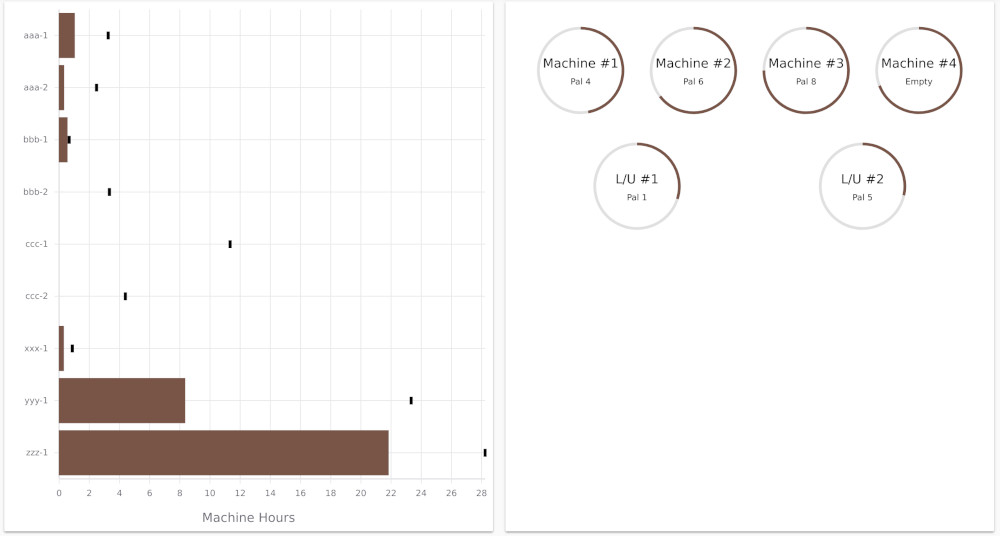

The dashboard shows an overview of the current status of the cell.  On the left is a bullet chart showing
the current jobs with their completed count and remaining machining time.  On the right is an overview of the
stations, showing the OEE for the past week and information about the pallet at each station (if any).

## Current Jobs

The bullet chart on the left shows the current progress of the jobs in the
cell controller. Each process of each job receives one row and the x-axis is
machine hours. A black tick mark is placed at the expected machining hours
for the entire job. For example, if the job for part `zzz` has a total
quantity of 22 parts and the expected machine cycle time is 77 minutes, the
expected total time for the job is `22 * 77 = 1694 minutes ~ 28.2 hours` so a
black tick mark will be placed at 28.2 hours (see the bottom row in the
screenshot above).

As parts are completed, a brown bar is filled in with the credited machine
hours for the completed parts. For example, if the job for part `zzz` has
completed 17 parts, then the credited machine hours is 17 times 77 minutes
which is about 21.8 hours so a brown bar will be drawn up to 21.8 hours (see
the bottom row in the screenshot above).  A completed part is credited only with
its expected cycle time even if the actual time on the machine is larger.  Also,
a completed part is assigned only once the part has been completely machined and unloaded.
Indeed, the bullet chart does not reflect in-process or partially machined material, because
the program might not finish correctly or the part might be become scrap.

The bullet chart is an easy way to watch the progress on the current jobs. If
a job is created for each day, the chart can be used to estimate the current
day's progress (keeping in mind that in-process material is not visible on
the chart).

## Stations

On the right of the dashboard, there is one circle for each machine and load station in the cell.
The outside of the station is a circular gauge displaying the operating equipment effectiveness (OEE)
for the past week.  This is calculated by taking all cycles from the past `7 * 24 = 168 hours`, adding up
their expected machine or load time, and dividing by 168 hours to obtain a percentage.  This percentage is used
to fill in the gauge on the outside of the station, and can also be viewed in a tooltip by mousing over the station.

In addition, each station shows the pallet currently at the station (if any) and when moused over the tooltip will
display additional information about the material on the pallet, including the program currently in execution,
expected remaining time, or parts being loaded.  More details about the current material on the various pallets
is available in the [station monitor tab](client-station-monitor.md).
