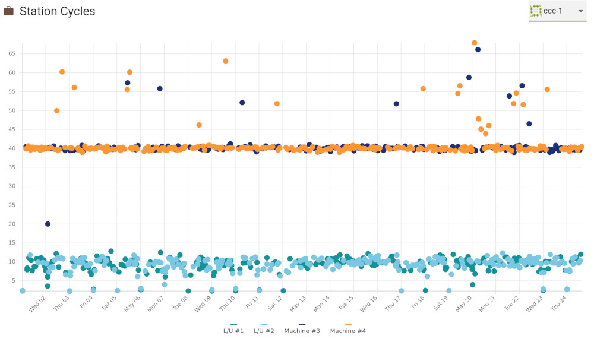
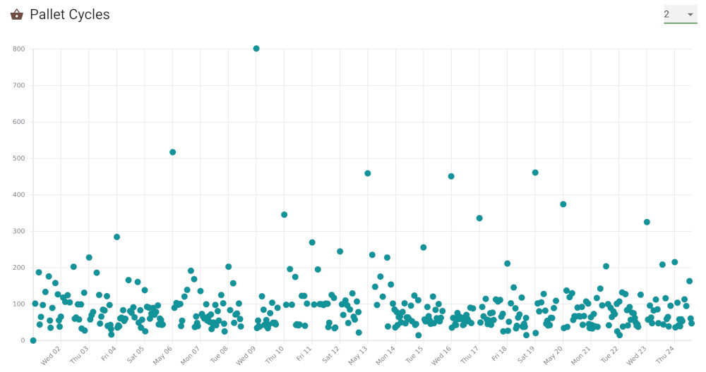
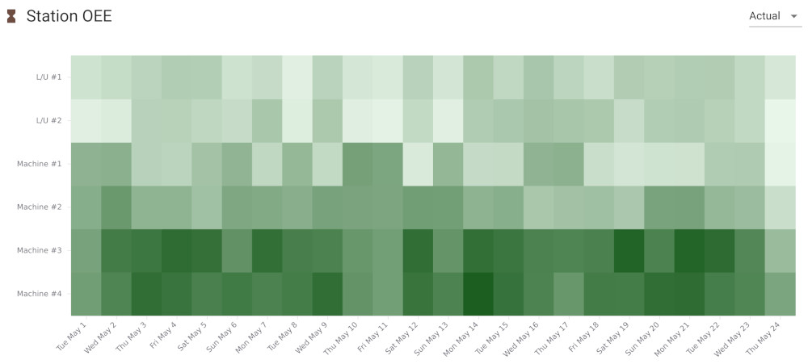
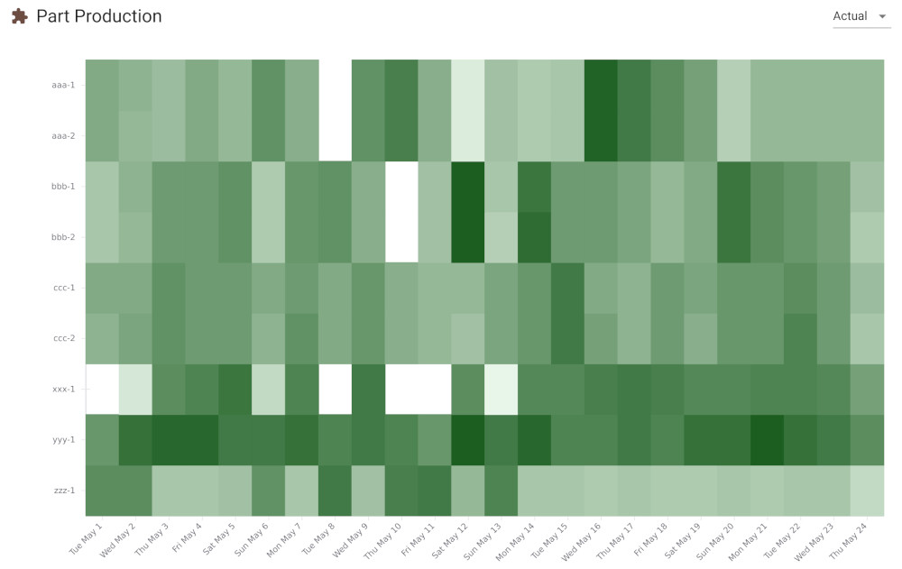
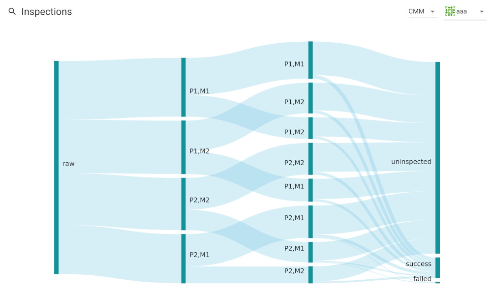

The efficiency tab shows some charts and graphs for a monthly summary of the
operation of the cell.  These reports are designed to expose potential inefficiencies
and problems, allowing you to gradually alter the flexibility or operation of the cell
to improve performance.  We suggest you review the efficiency data once per month.
At the top of the tab, you can choose to view either the data from the past 30 days or view
data for a specific month.

## Station Cycles

Select a part from the combo box in the top-right. Once selected, all load
and machine cycles for the part will be displayed. The x-axis is the days of
the month and the y-axis is cycle time in minutes. The cycle time is the wall
clock time between cycle start and cycle end of the machine or the wall clock
time between a pallet arriving at the load station to the pallet leaving the
load station. The legend at the bottom shows which colors correspond to which
stations, and by clicking on stations in the legend you can enable or
disable the viewing of specific stations. Finally, by clicking on a point you
can obtain details about that specific cycle in a tooltip.

The example screenshot above is an example of a part program which might need
improvement. We see that most of the machine cycles are fine at around 40
minutes, but there are quite a few machine cycles longer than 40 minutes
which likely come from program interruptions, tool problems, etc. and since
there are so many it is likely worth it to investigate and improve the part
program. On the other hand, if there were only a couple of machine cycles
longer than 40 minutes, we might instead conclude that it is not worth the
effort to spend a large amount of time focusing on this part. Finally, the
load station cycles seem consistent at between 5 and 15 minutes so likely no
improvements are required at the load station.  If instead there were a
large number of outlier load/unload times, we might spend some time investigating
and potentially making operational changes.  By periodically viewing this
cycle chart for each part, you can get a feel for your specific system
and iteratively detect and fix problems.

## Pallet Cycles

Select a pallet from the combo box in the top-right. Once selected, all
pallet cycles are displayed. The x-axis is the days of the month and the
y-axis is the pallet cycle time in minutes. A pallet cycle time is the wall
clock time from when a pallet leaves the load station to the next time it
leaves the load station. This will therefore include cart transfer time,
buffer time, machining time, and load/unload time.  By clicking on a point, you
can obtain more information about the pallet cycle in a tooltip.

## Station OEE

The Station OEE heatmap shows the station overall equipment effectiveness (OEE)
over the month.  On the x-axis are the days of the month and on the y-axis are
the machines and load stations.  For each station and each day, FMS Insight adds
up the expected operation time for each part cycle and then divides by 24 hours
to obtain a percentage that the station was busy with productive work.  (If station cycles
were longer than expected, this extra time is not counted in the OEE.  Thus the Station OEE
should only be focused on seriously once the station cycles are mostly stable at their
expected cycle time.)  For each grid cell in the chart, the OEE percentage is drawn
with a color with darker colors higher OEE and lighter colors lower OEE.  A grid cell
can be moused over to obtain extra information in a tooltip.

## Part Production

The Part Production heatmap shows the distribution of completed parts over
the month. On the x-axis are the days of the month and on the y-axis are the
part types. For each part and each day, FMS Insight counts how many parts
were produced that day. For each grid cell in the chart, the completed count
is drawn as a color with darker colors higher counts and lighter colors lower
counts. A grid cell can be moused over to obtain extra information in a
tooltip.

The part production and station OEE heatmaps are useful to brainstorm potential
flexibility changes.  For example, the above station OEE screenshot shows that
machines 3 and 4 have higher OEE than machines 1 and 2.  As long as station cycles
are stable around their expected time, this likely reflects that not enough pallets
and parts are routed to machines 1 and 2.  Looking at the part production heatmap,
some of the darker parts might be candidates to be expanded to include machines 1 and 2.
Indeed, in the scenario which produced the screenshot, part `yyy` was routed only
to machines 3 and 4 and we can see from the part heatmap that it has large production.
We could therefore brainstorm that part `yyy` could be expanded to also include machine 2.

Note that these heatmaps should only be used to brainstorm ideas.  We would still
to investigate if expanding `yyy` to include machine 2 would increase overall
system performance.  Are there enough pallets?  How many extra inspections are required?
Will this cause a traffic jam?  These questions can be answered using simulation,
Little's Law, or a tool such as our [SeedTactic: Planning](https://www.seedtactics.com/products/seedtactic-planning).

## Inspections

The inspections chart shows a Sankey diagram of the material paths and
inspection results. First, select an inspection type and then select a part
in the top right. FMS Insight then loads all cycles for this part for the
entire month and groups them according to their path (A path consists of a
pallet and machine for each process or sequence, plus the final inspection
result.) The counts of the various paths are then charted using a Sankey
diagram, where the widths of the bars are drawn scaled based on the quantity
of parts which took that path, with parts "flowing" from left to right.
Any link can be moused over to obtain additional information in a tooltip.

For example, in the above screenshot, one path is to use pallet 1 and machine
1 (P1,M1) for the first sequence and then pallet 1 and machine 2 for the
second sequence (P1,M2).  This corresponds to the large top link between `raw`
and `P1,M1` and then the downward-curved link between "P1,M1" on the left and
`P1,M2` on the right. The path is then further split with uninspected parts
and successfully inspected parts.

The width of these paths shows the relative count of parts taking these
paths. For example, starting from using pallet 1 and machine 1 on the first
sequence, parts either go to `P1,M1` meaning they return to machine 1 for
their second sequence or they go to `P1,M2` meaning the go to machine 2 for
their second sequence. The relative widths of the bars show that this is
about equal but slightly more parts return back to machine 1 for their second
sequence.  Similarly, the width of the links going to `uninspected` and `success`
show that most parts are not inspected while a few are inspected successfully.
