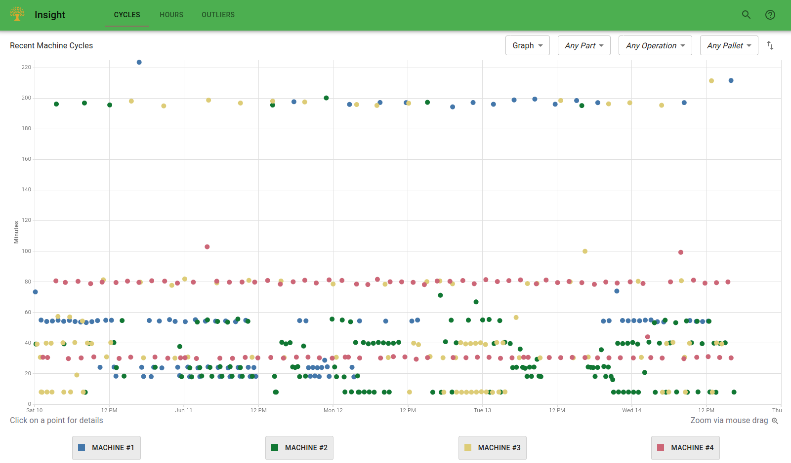
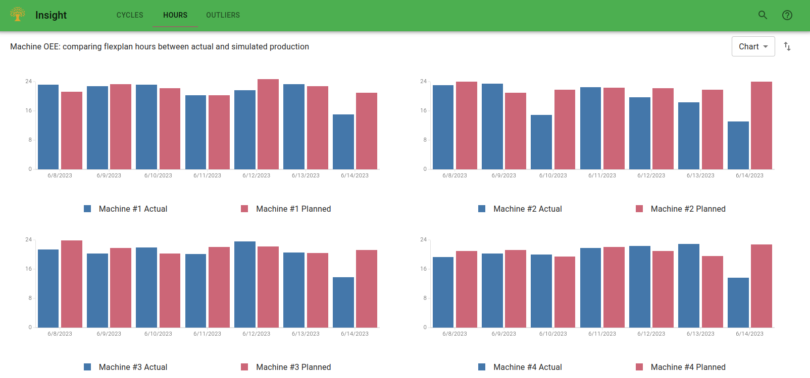
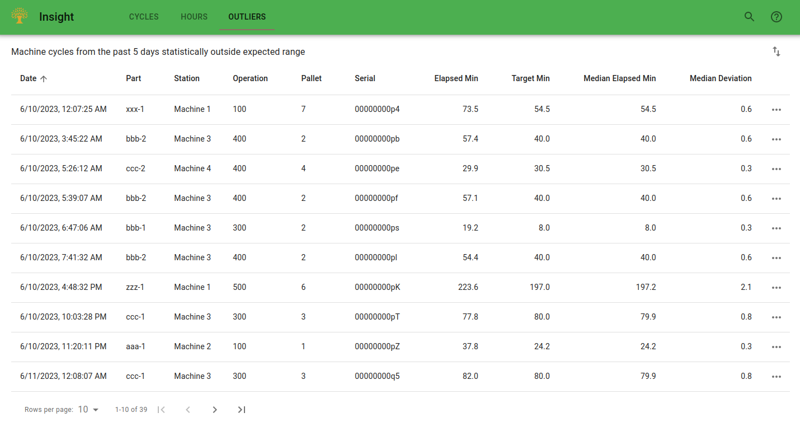

# FMS Insight Engineering Pages

The _Engineering_ page is intended for the part programming engineers. We suggest they bookmark this page and
visit it directly. The page can be used after a new part-program is introduced to closely watch the timings of
the new program. The page can also be used to stay on top of problematic programs which are frequently interrupted.
All data available here is also available in the reports tab of the [operations page](client-operations). The engineering
page just provides a dedicated place for engineers to bookmark and visit directly.

## Cycles

First, the page contains a tab with a chart of all machine cycles from the past 3 days. The chart can
be zoomed by clicking and dragging, filtered to specific parts and/or
pallets, and toggled to a table. Clicking on any point allows more details
about the cycle to be loaded. Anything older than 3
days is available as part of the [monthly review](improve-fms) on the
[flexibility analysis page](client-flexibility-analysis).

## Hours

In the Hours tab, the planned and actual machine hours for the past 7 days are shown. The
data can be toggled between a bar chart and a table. Anything older than 7
days is available as part of the [monthly review](improve-fms) on the
[flexibility analysis page](client-flexibility-analysis).

## Outliers

On the Outliers tab, there is a table which shows cycles from the last three days which are
statistical outliers. The outlier detection is based on the [median absolute
deviation of the
median](https://en.wikipedia.org/wiki/Median_absolute_deviation), which is
more resilient to outliers than the standard deviation. There are two reasons that a machine
cycle will appear here:

- If the actual time on the machine is far away from the median actual time, the cycle will be displayed. Cycles of this
  type indicate that the program was interrupted and took longer than expected.
- If the expected machine time from the job is far away from the median actual time, the cycle will be displayed. Cycles of this
  type indicate that the expected time is unrealistic (as long as enough cycles are available to obtain good statistics). In this
  case, the expected machine time in the flexibility plan should be adjusted to be equal to the median time. Alternatively,
  perhaps the program should be changed to improve the machine time.
