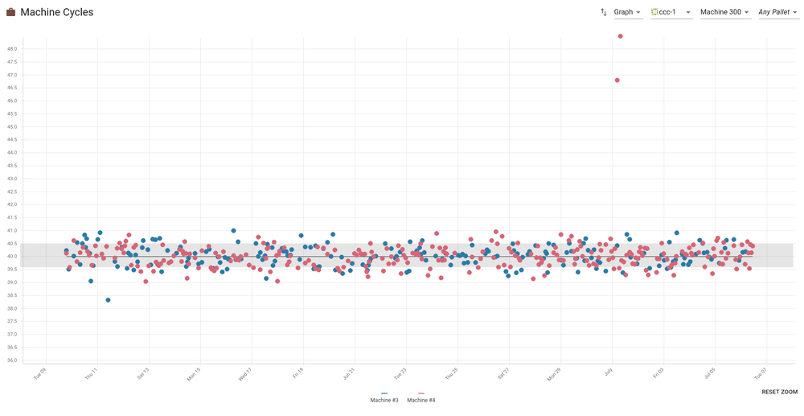
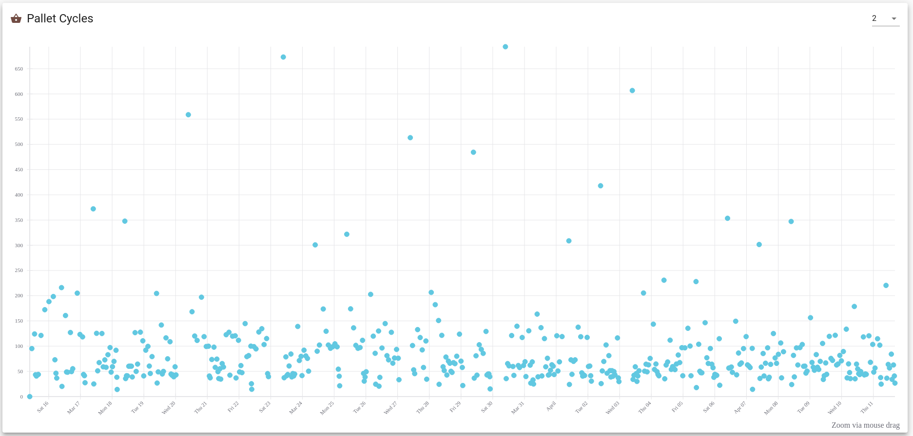
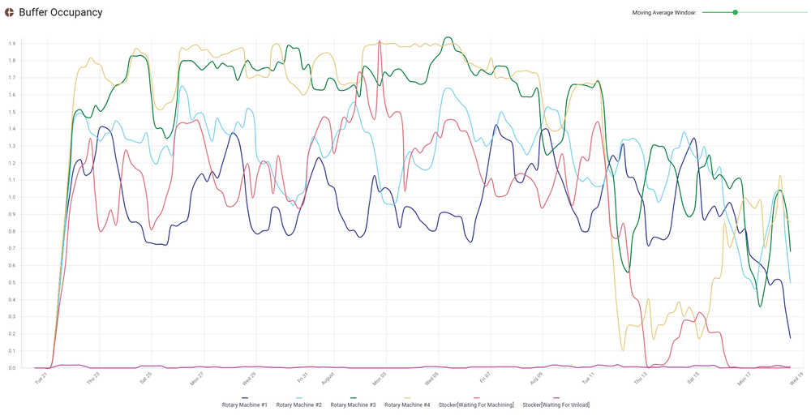
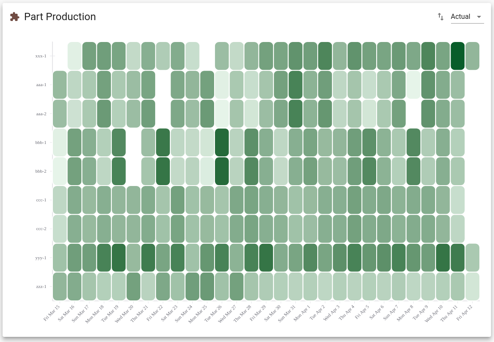
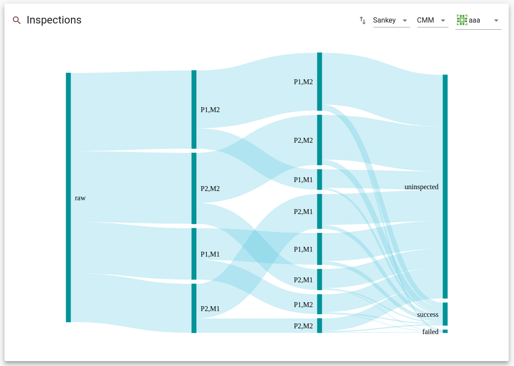

# FMS Insight Monthly Flexibility Analysis

FMS Insight supports continuous improvement by assisting with a monthly review.
We suggest that approximately once a month, all stakeholders review the operation of the cell and
decide on potential improvements. The [improve an FMS](improve-fms)
documentation goes into more details about how to make the most of these
efficiency calculations.

At the top of the page are two radio buttons allowing you to analyize either the last
30 days or a specific calendar month.

# Efficiency

The best metric for continuous improvement of an FMS is not cost/piece but
instead is the bottlenecks and utilization of system resources (the
goal is to produce more stuff with the same machines and quality). The
efficiency tab shows some charts and graphs for a monthly summary of the
operation of the cell, displaying reports that in our experience are very
helpful to find and fix bottlenecks. We suggest you review this data once a
month and use these reports to gradually alter the flexibility or operation
of the cell to improve the performance.

## Machine Cycles

The machine cycle chart displays a point for each program cycle. The cycles
can be filtered by a specific part, a specific program, a specific machine, a
specific pallet or a combination. The x-axis is the days of the month and the
y-axis is cycle time in minutes. The cycle time is the wall clock time
between program start and program end of the machine. The legend at the
bottom shows which colors correspond to which stations, and by clicking on
stations in the legend you can enable or disable the viewing of specific
stations. By clicking on a point you can obtain details about that specific
cycle in a tooltip and open the material card for the cycle. Finally, the
chart can be zoomed by clicking and dragging.

When a specific part and specific program are selected, a gray background and
black horizontal line are shown. The gray background is calculated to be the
statistical median and deviation of the points; the middle of the gray band is
the median of the program time and the width of the band is determined by calculating
the median absolute deviation of the median (MAD). In contrast, the horizontal
black line is the expected cycle time entered during scheduling and sent in
the scheduled jobs. Thus if the horizontal black line differs
significantly from the middle of the gray band, this means that likely the expected
time used in the simulation and scheduling is incorrect.

The example screenshot above is an example of a part program which looks
good. We see that almost all of the machine cycles are around 40 minutes,
within the gray band and the horizontal black line and there are only a
couple machine cycles significantly longer than 40 minutes which likely come
from program interruptions, tool problems, etc. Since there are only a couple
outlier points, we might instead conclude that it is not worth the effort to
spend a large amount of time focusing on this part. If instead the graph
showed many points outside the gray band and longer than 40 minutes, it would
be worth it to investigate and improve the part program and tooling.

The cycles can be toggled to display the raw data in a table instead of a chart.
The table can be filtered, sorted, and restricted to a specific date range. The resulting
raw data can be copied to the clipboard to be pasted into a spreadsheet for further analysis.

## Load/Unload Cycles

The load/unload cycle chart displays a point for each load or unload event.
The x-axis is the days of the month and the y-axis is time in minutes.
The cycles can be filtered by a specific part or pallet. The chart will display one of
three possible times for each operation: "L/U Occupancy", "Load (estimated)", and "Unload (estimated)".

The "L/U Occupancy" chart displays a point for the wall clock time that the pallet spends at the
load station; the time from the pallet arriving at the load station until the operator presses
the ready button. This is the time that FMS Insight collects and stores
so this chart displays the actual raw data collected.

Despite being the actual data FMS Insight collects, the "L/U Occupancy" chart
is hard to use to determine if there are problems or slowdowns in loading a
specific part. The recorded time is the wall clock time from pallet arrival
to departure so includes all the operations which occur at the load station
which might include a load and an unload or just a load or just an unload.
Thus, FMS Insight attempts to split the wall clock occupied time of the
pallet at the load station among the various operations such as loading or
unloading that occurred.

For each cycle, FMS Insight splits the time the pallet spends at the load
station among each piece of material being loaded, transfered, or unload. To
do so, FMS Insight uses the list of material loaded/unloaded/transfered and
calculates the expected time the operation should take based on the values
entered into the scheduled jobs. The expected time is
then used to calculate a percentage consuption for each material, and this
percentage is then applied to the actual wall clock time of the pallet
occupancy. For example, consider an operation where part _aaa_ is loaded and
part _bbb_ is unloaded. The schedule says that the loading of _aaa_ should
take 5 minutes and the unloading of _bbb_ should take 8 minutes for a total
time the pallet should spend at the load station of 13 minutes. Now say that
the pallet actually spent 15 minutes at the load station. The load of _aaa_
is expected to consume `5/13 = 38%` of the cycle and the unload of _bbb_ is
expected to consume `8/13 = 62%` of the cycle. The 38% is multipled by the
actual wall clock time of 15 minutes to give approximately 5.8 minutes for
the load of _aaa_. Similarly for the unload of _bbb_, 15 minutes times 62% is
approximately 9.2 minutes. Note how the "extra" 2 minutes (15 minutes
compared to 13 minutes) for the entire cycle is divided among both the load
and the unload operation. This calculation is repeated separately for each
load/unload cycle.

The result of FMS Insight's estimated splitting is graphed in the "Load
Operation (estimated)" and "Unload Operation (estimated)" charts selected in
the top-right corner. The screenshot above shows the "Load Operation
(estimated)" chart. For each load/unload cycle, FMS Insight splits the time
as described above and then plots a point with the y-coordinate the
calculated time, filtering the data to a specific part and/or pallet. (In the
example from the previous paragraph, the points would have y-coordinate 5.8
and 9.2 minutes.) Exactly like the machine cycles, FMS Insight calculates the
median and median absolute deviaion of the points and plots them as a gray band
in the background. Finally, the expected time entered into the
scheduled jobs is graphed as a horizontal black line.

## Pallet Cycles

Select a pallet from the combo box in the top-right. Once selected, all
pallet cycles are displayed. The x-axis is the days of the month and the
y-axis is the pallet cycle time in minutes. A pallet cycle time is the wall
clock time from when a pallet leaves the load station to the next time it
leaves the load station. This will therefore include cart transfer time,
buffer time, machining time, and load/unload time. By clicking on a point,
you can obtain more information about the pallet cycle in a tooltip.
Similarly to the station cycle chart, the pallet cycle chart can be zoomed by
clicking and dragging or the zoom range can be manually set via the button in
the bottom-right.

The pallet cycle chart is best used to determine if the cell is running lean
and validate the [daily allocation and scheduling
technique](https://www.seedtactics.com/docs/concepts/preventing-traffic-jams)
to determine if there are traffic jams occuring in the pallets. In a lean,
healthy cell, most pallet cycles should be low and reasonably consistent. If
pallet cycle times vary wildly, there is likely taffic jams or other flow problems.

## Buffer Occupancy

As material moves through the system, it buffers before various operations. It can buffer
on a pallet waiting on the inbound rotary table, it can buffer on a pallet in the
stocker waiting for either machining or unloading, or it can buffer between processes
in a [transfer queue](material-tracking). In general, material will buffer right in
front of the bottleneck operation. The buffer occupancy chart can thus be used to determine
which operation (machining, loading, unloading) is the current bottleneck and also how the
bottleneck changes over time.

The buffer occupancy chart calculates a moving average of the quantity of material buffered
in all these various places. The x-axis is the days of the month. For each time on
the x-axis, a window around that point is used to calculate the average quantity of material
in the buffer during the window of time. This average quantity is graphed on the y-axis.

Using a moving average window smooths out the jitter from individual pallet moves,
for example when a pallet rotates into the machine and another pallet is quickly
sent to the inbound rotary. The size of the window can be controlled by the slider
in the top-right. The size of the window should be set so that the major trends are
visible while short oscillations are smoothed out.

In an efficient, well-running system the bottleneck is always machining. This will be
reflected in the buffer occupancy chart with the "Stocker[Waiting for unload]" line zero
or almost zero, the "Rotary" for each machine always above zero, the
"Stocker[Waiting for machining]" only positive if all rotary tables are full, and any
in-process transfer queues small. If instead the load stations become the bottleneck,
the buffer occupancy chart will show a rise either "Stocker[Wating for unload]" or a
rise in the in-process transfer queue between processes. Also, the rotary buffer
occupancy will drop to zero.

## Station Use

The Station Use heatmap shows the station usage over the month. On the x-axis
are the days of the month and on the y-axis are the machines and load
stations. There are three charts which can be selected in the top-right
corner: "Standard OEE", "Planned OEE", and "Occupied".

- The "Standard OEE" chart computes the actual overall equipment effectiveness (OEE) over the month.
  For each station and each day, FMS Insight uses the log of parts produced and adds up the expected
  operation time for each part cycle and then divides by 24 hours
  to obtain a percentage that the station was busy with productive work. (If station cycles
  were longer than expected, this extra time is not counted in the OEE.) For each grid cell in the chart, the OEE percentage is drawn
  with a color with darker colors higher OEE and lighter colors lower OEE. A grid cell
  can be moused over to obtain extra information in a tooltip.

- The "Planned OEE" chart displays the simulated station usage for the downloaded jobs and
  is the prediction of what the OEE should look like based on all the schedules for the month.

- The "Occupied" chart computes the total percentage of time that a pallet is occupying the station. For
  each station and each day, FMS Insight uses the log of events to determine when a pallet arrives
  and departs from each station. The total time a pallet is at the station is then divided by 24 hours
  to obtain a percentage that the station was occupied. These percentages are then charted with darker colors
  higher occupancy.

The Station Use heatmaps are useful for several observations. First, the Occupied heatmap can be used to
determine the overall usage of the load station. If the load station occupied percentages are very high,
it can indicate that the load station is a bottleneck and preventing the cell from performing useful work.
In a healthy cell, the load stations should be faster than the machines,
so the load stations should be empty at least part of the time waiting for machining to finish.

The difference between the Standard OEE and Occupied heatmaps can be useful to determine if there is a lot
of cycle interruptions. For example, if a program is expected to take 25 minutes but spends 40 minutes at
the machine, the Standard OEE heatmap will be credited with 25 minutes and the Occupied heatmap will be
credited with 40 minutes, causing the Occupied heatmap to be darker in color for that day. Now, cycle
interruptions do occasionally happen; comparing the Standard OEE and Occupied heatmaps allows you to
determine if these are one-off events or a consistent problem. If most days are darker on the Occupied
heatmap, the cycle interruptions should be investigated in more detail. (For example, look at individual parts on the
machine cycle charts, ensure the expected time entered into the schedule is actually correct, investigate
machine maintenance records, etc.)

Finally, the Standard OEE heatmap helps visualize how balanced the machines were loaded over the month.
We want to see all the machines consitantly roughly the same color. If you see that
a machine has a lighter color for a couple days, that indiciates either the machine was down or
that the daily mix for that day did not have enough flexibility. You should then consider
picking a part and extending that part to run on the lightly loaded machine. To find such a
part, you can use the part production chart below to see which part mix was run on this day
to help find a part that might be changed to run on the lightly loaded machine.

## Part Production

The Part Production heatmap shows the distribution of completed parts over
the month. On the x-axis are the days of the month and on the y-axis are the
part types. For each part and each day, FMS Insight counts how many parts
were produced that day. For each grid cell in the chart, the entry
is drawn as a color with darker colors higher machine hours and lighter colors lower
machine hours. A grid cell can be moused over to obtain extra information in a
tooltip.

The part production OEE heatmap is mainly useful to visualize the part mix as it
varies throughout the month, by comparing the relative color shades. Also, it can help
find a part to change move onto a lightly loaded machine. For example, consider that a machine
is found to be lightly loaded via the station OEE heatmap. That same day can be viewed on
the part production OEE heatmap and the darkest colored part was the highest run that day and
could be considered to be extended to be run on the lightly loaded machine.

Note that these heatmaps should only be used to brainstorm ideas. We would still
to investigate if expanding `yyy` to include machine 2 would increase overall
system performance. Are there enough pallets? How many extra inspections are required?
Will this cause a traffic jam? These questions can be answered using simulation, _SeedTactic: Designer_,
Little's Law, or a tool such as our [SeedTactic: Planning](https://www.seedtactics.com/features#seedtactic-planning).

## Inspections

The inspections chart shows a Sankey diagram of the material paths and
inspection results. First, select an inspection type and then select a part
in the top right. FMS Insight then loads all cycles for this part for the
entire month and groups them according to their path (A path consists of a
pallet and machine for each process or sequence, plus the final inspection
result.) The counts of the various paths are then charted using a Sankey
diagram, where the widths of the bars are drawn scaled based on the quantity
of parts which took that path, with parts "flowing" from left to right.
Any link can be moused over to obtain additional information in a tooltip.

For example, in the above screenshot, one path is to use pallet 1 and machine
2 (P1,M2) for the first sequence and then pallet 1 and machine 1 for the
second sequence (P1,M1). This corresponds to the large top link between `raw`
and `P1,M2` and then the downward-curved link between `P1,M2` on the left and
`P1,M1` on the right. The path is then further split with uninspected parts
and successfully inspected parts.

The width of these paths shows the relative count of parts taking these
paths. For example, starting from using pallet 1 and machine 1 on the first
sequence, parts either go to `P1,M1` meaning they return to machine 1 for
their second sequence or they go to `P1,M2` meaning the go to machine 2 for
their second sequence. The relative widths of the bars show that this is
about equal but slightly more parts return back to machine 1 for their second
sequence. Similarly, the width of the links going to `uninspected` and `success`
show that most parts are not inspected while a few are inspected successfully.
