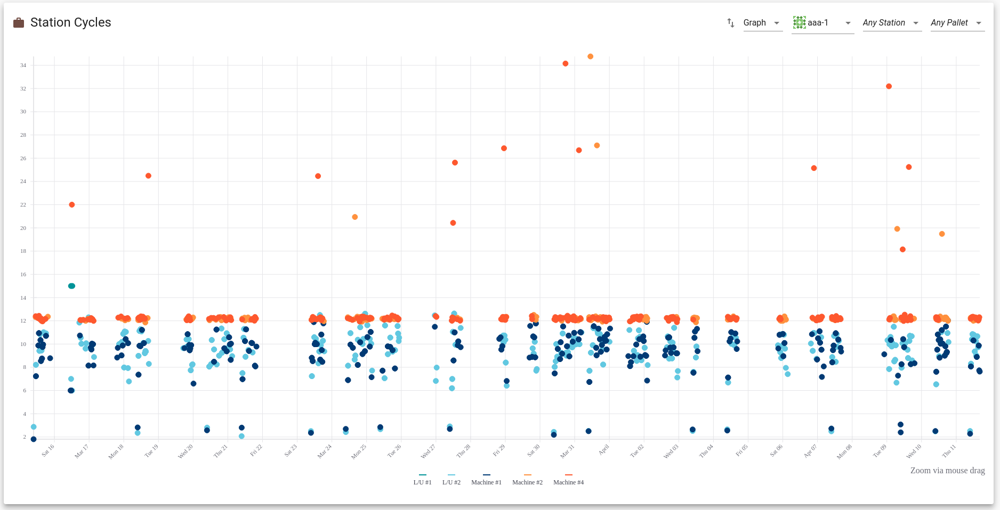
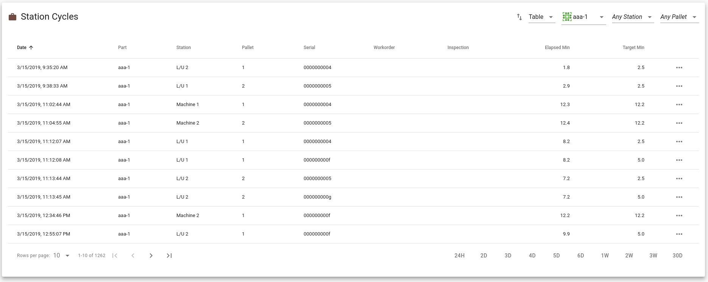
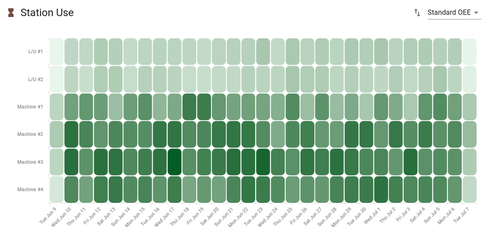

FMS Insight supports continuous improvement by assisting with a monthly review.
We suggest that approximately once a month, all stakeholders review the operation of the cell and
decide on potential improvements. The [improve an FMS](improve-fms.md)
documentation goes into more details about how to make the most of these
efficiency calculations.

At the top of the page are two radio buttons allowing you to analyize either the last
30 days or a specific calendar month.

# Efficiency

The best metric for continuous improvement of an FMS is not cost/piece but
instead is the bottlenecks and utilization of system resources (the
goal is to produce more stuff with the same machines and quality). The
efficiency tab shows some charts and graphs for a monthly summary of the
operation of the cell, displaying reports that in our experience are very
helpful to find and fix bottlenecks. We suggest you review this data once a
month and use these reports to gradually alter the flexibility or operation
of the cell to improve the performance.

## Station Cycles

The station cycle chart displays a point for each load and machine cycle. The
cycles can be filtered by a specific part, a specific machine, a specific
pallet or a combination. The x-axis is the days of the month and the y-axis
is cycle time in minutes. The cycle time is the wall clock time between cycle
start and cycle end of the machine or the wall clock time between a pallet
arriving at the load station to the pallet leaving the load station. The
legend at the bottom shows which colors correspond to which stations, and by
clicking on stations in the legend you can enable or disable the viewing of
specific stations. By clicking on a point you can obtain details about that
specific cycle in a tooltip and open the material card for the cycle.
Finally, the chart can be zoomed by clicking and dragging.

The example screenshot above is an example of a part program which might need
improvement. We see that most of the machine cycles are fine at around 40
minutes, but there are quite a few machine cycles longer than 40 minutes
which likely come from program interruptions, tool problems, etc. and since
there are so many it is likely worth it to investigate and improve the part
program. On the other hand, if there were only a couple of machine cycles
longer than 40 minutes, we might instead conclude that it is not worth the
effort to spend a large amount of time focusing on this part. Finally, the
load station cycles seem consistent at between 5 and 15 minutes so likely no
improvements are required at the load station. If instead there were a
large number of outlier load/unload times, we might spend some time investigating
and potentially making operational changes. By periodically viewing this
cycle chart for each part, you can get a feel for your specific system
and iteratively detect and fix problems.

The cycles can be toggled to display the raw data in a table instead of a chart.
The table can be filtered, sorted, and restricted to a specific date range. The resulting
raw data can be copied to the clipboard to be pasted into a spreadsheet for further analysis.

## Pallet Cycles

Select a pallet from the combo box in the top-right. Once selected, all
pallet cycles are displayed. The x-axis is the days of the month and the
y-axis is the pallet cycle time in minutes. A pallet cycle time is the wall
clock time from when a pallet leaves the load station to the next time it
leaves the load station. This will therefore include cart transfer time,
buffer time, machining time, and load/unload time. By clicking on a point,
you can obtain more information about the pallet cycle in a tooltip.
Similarly to the station cycle chart, the pallet cycle chart can be zoomed by
clicking and dragging or the zoom range can be manually set via the button in
the bottom-right.

The pallet cycle chart is best used to determine if the cell is running lean
and validate the [daily allocation and scheduling
technique](https://www.seedtactics.com/docs/concepts/preventing-traffic-jams)
to determine if there are traffic jams occuring in the pallets. In a lean,
healthy cell, most pallet cycles should be low and reasonably consistent. If
pallet cycle times vary wildly, there is likely taffic jams or other flow problems.

## Station OEE

The Station OEE heatmap shows the station overall equipment effectiveness (OEE)
over the month. On the x-axis are the days of the month and on the y-axis are
the machines and load stations. For each station and each day, FMS Insight adds
up the expected operation time for each part cycle and then divides by 24 hours
to obtain a percentage that the station was busy with productive work. (If station cycles
were longer than expected, this extra time is not counted in the OEE. Thus the Station OEE
should only be focused on seriously once the station cycles are mostly stable at their
expected cycle time.) For each grid cell in the chart, the OEE percentage is drawn
with a color with darker colors higher OEE and lighter colors lower OEE. A grid cell
can be moused over to obtain extra information in a tooltip.

The Station OEE heatmap helps visualize how balanced the machines were loaded over the month.
We want to see all the machines consitantly roughly the same color. If you see that
a machine has a lighter color for a couple days, that indiciates either the machine was down or
that the daily mix for that day did not have enough flexibility. You should then consider
picking a part and extending that part to run on the lightly loaded machine. To find such a
part, you can use the part production chart below to see which part mix was run on this day
to help find a part that might be changed to run on the lightly loaded machine.

## Part Production

The Part Production heatmap shows the distribution of completed parts over
the month. On the x-axis are the days of the month and on the y-axis are the
part types. For each part and each day, FMS Insight counts how many parts
were produced that day. For each grid cell in the chart, the entry
is drawn as a color with darker colors higher machine hours and lighter colors lower
machine hours. A grid cell can be moused over to obtain extra information in a
tooltip.

The part production OEE heatmap is mainly useful to visualize the part mix as it
varies throughout the month, by comparing the relative color shades. Also, it can help
find a part to change move onto a lightly loaded machine. For example, consider that a machine
is found to be lightly loaded via the station OEE heatmap. That same day can be viewed on
the part production OEE heatmap and the darkest colored part was the highest run that day and
could be considered to be extended to be run on the lightly loaded machine.

Note that these heatmaps should only be used to brainstorm ideas. We would still
to investigate if expanding `yyy` to include machine 2 would increase overall
system performance. Are there enough pallets? How many extra inspections are required?
Will this cause a traffic jam? These questions can be answered using simulation, _SeedTactic: Designer_,
Little's Law, or a tool such as our [SeedTactic: Planning](https://www.seedtactics.com/products/seedtactic-planning).

## Inspections

The inspections chart shows a Sankey diagram of the material paths and
inspection results. First, select an inspection type and then select a part
in the top right. FMS Insight then loads all cycles for this part for the
entire month and groups them according to their path (A path consists of a
pallet and machine for each process or sequence, plus the final inspection
result.) The counts of the various paths are then charted using a Sankey
diagram, where the widths of the bars are drawn scaled based on the quantity
of parts which took that path, with parts "flowing" from left to right.
Any link can be moused over to obtain additional information in a tooltip.

For example, in the above screenshot, one path is to use pallet 1 and machine
2 (P1,M2) for the first sequence and then pallet 1 and machine 1 for the
second sequence (P1,M1). This corresponds to the large top link between `raw`
and `P1,M2` and then the downward-curved link between `P1,M2` on the left and
`P1,M1` on the right. The path is then further split with uninspected parts
and successfully inspected parts.

The width of these paths shows the relative count of parts taking these
paths. For example, starting from using pallet 1 and machine 1 on the first
sequence, parts either go to `P1,M1` meaning they return to machine 1 for
their second sequence or they go to `P1,M2` meaning the go to machine 2 for
their second sequence. The relative widths of the bars show that this is
about equal but slightly more parts return back to machine 1 for their second
sequence. Similarly, the width of the links going to `uninspected` and `success`
show that most parts are not inspected while a few are inspected successfully.

# Cost/Piece

Cost-per-piece is a great [actionable insight](improve-fms.md) for scheduling, operations
management, future capital purchases, quoting work, accounting, and
budgeting. The cost/piece tab is largely intended to serve as a
verification that flexibility and operational changes are reducing part
costs; you can compare part costs from before a change to after a change to
understand if the change improved the system.
Indeed, FMS Insight has a narrow view of just the cell itself and does not
take into account any overhead or other costs. Therefore, for budgeting,
quoting work, and other management decisions, we suggest that you [export the
workorder data](workorder-report.md) to your ERP and implement a cost report
in your ERP taking into account all factors.

Cost/piece is not a great metric to use initially when searching for techniques
to improve the cell's operation, since
focusing only on cost/piece risks introducing quality problems and OEE
reduction. Instead, cost/piece is a great metric to use after-the-fact to determine
if an implemented change in production operations has had a meaningful impact on
cost/piece.

## Calculations

Calculating cost-per-piece requires splitting large fixed costs such as machine depreciation and
labor across the parts that were produced. To do so, we use a monthly analysis window and
divide large fixed costs by the planned use of resources.

For example, consider that a machine depreciates at $7,000 a month and you have a 4-machine system, so that
the total machining overhead is $28,000 a month. The system produces two part types, aaa and bbb,
and aaa has a planned cycle time of 3 hours and bbb has a planned cycle time of 2 hours.
For January we collect data on the total number of parts produced by the system. Consider that
in January the system produced 400 aaa parts and 500 bbb parts. We then calculate cost-per-piece as
follows. Since we produced 400 aaa parts, those aaa parts should have used 400\*3 = 1200
machine-hours. Similarly, the bbb parts should have used 500\*2 = 1000 hours. The \$28,000 machine
cost is then divided using these planned machine-hours as weights. That is, of the planned machine
hours, aaa used `1200 / (1000 + 1200) = 54.5%` of the hours and bbb used
`1000 / (1000 + 1200) = 45.5%` of the hours. Then

    total machining cost of aaa in January = $28,000 * 0.545 = $15,272
    machining cost-per-piece of aaa in January = $15,272 / 400 = $38.18

and

    total machining cost of bbb in January = $28,000 * 0.455 = $12,727
    machining cost-per-piece of bbb in January = $12,727 / 500 = $25.45

Similar calculations happen for labor, tooling, and inspection. (Also, there are some
simplifications and cancellations that can be made in the above formulas, but in our experience calculating the
percentages first and then the cost helps improve visibility.)

From a cost perspective, any bottlenecks or utilization slowdowns should be viewed as system
problems and all parts are responsible for a portion of this cost. Indeed, The cost-per-piece
metric is an actionable insight for quoting orders and justifying future capital investments and for
these purposes any OEE problems are a problem for everything produced by the system. The above
method does this by using planned cycle times to divide the total machine cost (which includes
active and idle time) among the parts produced during the month based on their weights. A quick
calculation of machine utilization gives `(1200 + 1000) / (24*30*4) = 76%` use. The above method
divides the 24% of the time the machine is not in use among aaa and bbb based on their percentages
of planned use. Attempting to identify OEE problems are better addressed using the efficiency tab.

## Part Cost/Piece

The card labeled "Part Cost/Piece" shows the results of the cost
calculations, based on the values entered in the "Cost Inputs" card.
FMS Insight takes the total labor and station costs calculated
for the whole month and then divides it among the parts weighted by their use
of the resource. For example, when dividing up machining cost, FMS
Insight will sum up the expected machine cycle time for all part cycles that
were produced during the month, and then sum up the expected machine cycle
time for part `aaa`. Dividing these two quantities, FMS Insight obtains a
percentage use of the machine for part `aaa`. FMS Insight takes the total
machine cost (number of machines times machine yearly cost divided by 12) and
multiplies it by the use percentage. This produces the machining cost of the
`aaa` part for the month, and finally this cost is divided by the number of
`aaa` parts produced to obtain a cost/piece. This calculation is repeated for
each station and for the labor use.

For automation costs, FMS Insight first computes the total number of pallet cycles over the whole month
(a pallet cycle consists of a pallet leaving the load station, being machined, and returning
to the load station). Next, for each part, FMS Insight sums up the number of pallet cycles
for this part. Dividing these two, we obtain a percentage of the pallet cycles used for
a specific part. The total automation cost is then divided up among the parts based on
their percentage use of all the pallet cycles.

The data can be copied to the clipboard via the two-arrow-icon button in the top right.
