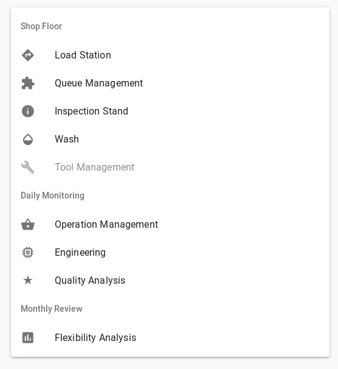

Once installed, the FMS Insight client can be launched by connecting to the
server using a browser. Any recent version of Firefox, Chrome, Edge, Android,
or iOS browsers will work (Internet Explorer is too old to work). By default,
FMS Insight listens on port 5000 and uses `http` so you can visit `http://<ip address or name of insigt server>:5000` from your browser. From the computer
on which you installed FMS Insight server, you can open the FMS Insight
client by visiting [http://localhost:5000](http://localhost:5000). Make sure
that firewall rules allow connections on port 5000 through to the FMS Insight
server. (The port 5000 and using https/SSL instead of http can be changed in
the [server configuration](server-config.md).)

# Targeted Pages

Many people throughout the factory interact with the cell in different ways.
Thus, FMS Insight provides specific pages targeted at specific users which
display relevant information. We suggest that you bookmark this page or set
it as the home page of the browser.

Once launched, the user must choose one of the following modes:

- [Load Station, Queue Management, Inspection Stand, Wash](client-station-monitor.md)
- [Operation Management](client-operations.md)
- [Engineering](client-engineering.md)
- [Quality Analysis](client-quality.md)
- [Flexibility Analysis](client-flexibility-analysis.md)
