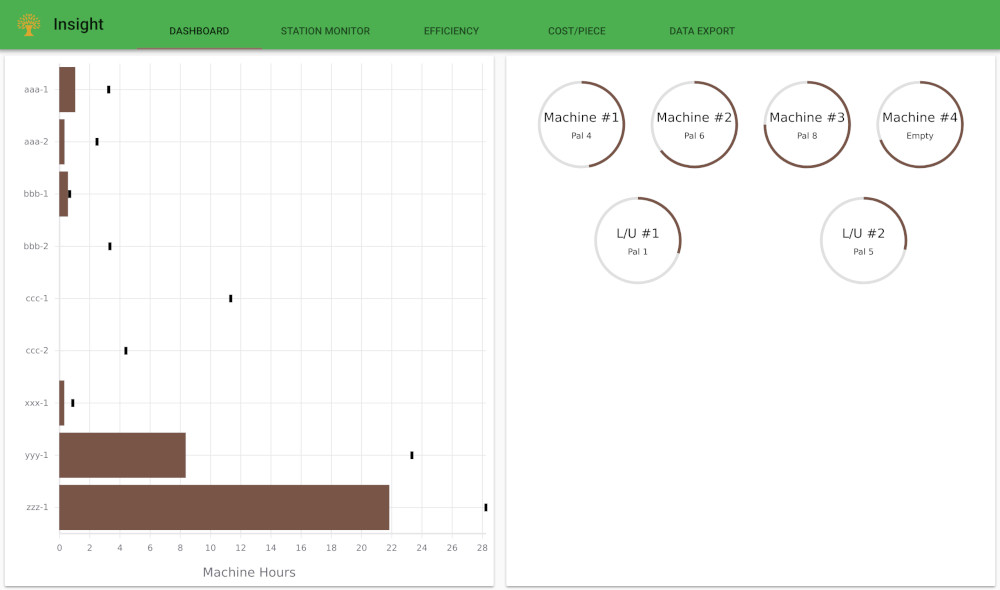

Once installed, the FMS Insight client can be launched by connecting to the
server using a browser. Any recent version of Firefox, Chrome, or Edge will
work (old versions of Internet Explorer only partially work). By default, FMS
Insight listens on port 5000 and uses `http` so you can visit `http://<ip
address or name of insigt server>:5000` from your browser. From the computer
on which you installed FMS Insight server, you can open the FMS Insight client by
visting [http://localhost:5000](http://localhost:5000). We suggest that you
bookmark this page or set it as the home page of the browser.  If you have multiple cells,
just create multiple bookmarks, one for each cell.

For example, if the FMS Insight server is on the factory network with IP
address `192.0.2.5`, you can visit `http://192.0.2.5:5000` from any browser
in the factory. Make sure that firewall rules allow connections on port 5000
through to the FMS Insight server. (The port 5000 and using https/SSL instead of http can
be changed in the [server configuration](server-config.md).)

## Tabs

Once launched, the default page is the dashboard.  There are four main tabs:

* [Dashboard](client-dashboard.md)
* [Station Monitor](client-station-monitor.md)
* [Efficiency](client-efficiency.md)
* [Cost/Piece](client-cost-per-piece.md)