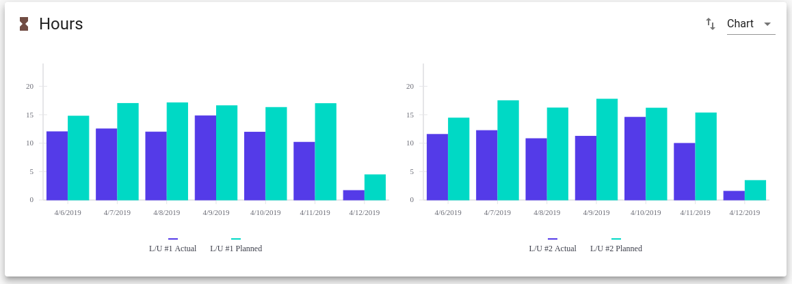
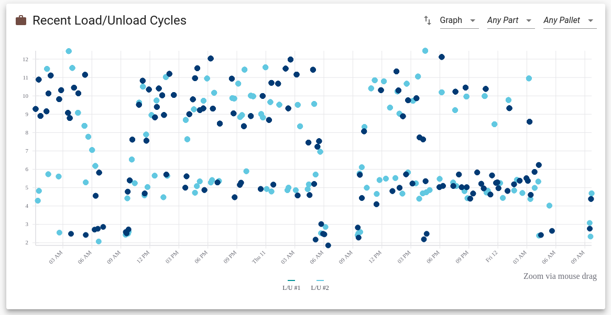
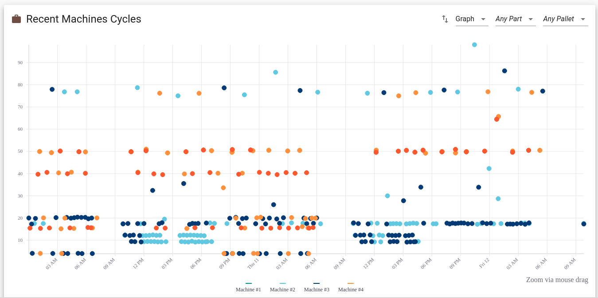
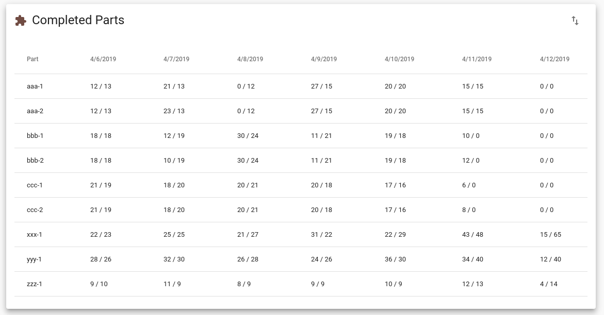

The operations pages are intended for the floor supervisor. These pages display information about
the past few days of cell operation and allow the supervisor to keep the cell operating smoothly.
(Anything older than a couple days should not be analyzed on the shop floor the heat of the moment but
instead be addressed in a [monthly review](improve-fms.md).)

We suggest that the operations dashboard is bookmarked by the supervisor and visited directly.
There are also tabs for monitoring the operators at the load station, the machine cycle times,
and all the material in the system.

# Dashboard

The dashboard shows an overview of the current status of the cell.
The supervisor should keep the dashboard open since it allows at a quick glance to
understand if the cell is running well.

On the left is a bullet chart showing the current jobs with their completed
count and remaining machining time. On the right is an overview of the
stations, showing the OEE for the past week and information about the pallet
at each station (if any).

The bullet chart on the left shows the current progress of the jobs in the
cell controller. Each process of each job receives one row and the x-axis is
machine hours. A black tick mark is placed at the expected machining hours
for the entire job. For example, if the job for part `zzz` has a total
quantity of 22 parts and the expected machine cycle time is 77 minutes, the
expected total time for the job is `22 * 77 = 1694 minutes ~ 28.2 hours` so a
black tick mark will be placed at 28.2 hours (see the bottom row in the
screenshot above).

As parts are completed, a brown bar is filled in with the credited machine
hours for the completed parts. For example, if the job for part `zzz` has
completed 17 parts, then the credited machine hours is 17 times 77 minutes
which is about 21.8 hours so a brown bar will be drawn up to 21.8 hours (see
the bottom row in the screenshot above). A completed part is credited only with
its expected cycle time even if the actual time on the machine is larger. Also,
a completed part is assigned only once the part has been completely machined and unloaded.
Indeed, the bullet chart does not reflect in-process or partially machined material, because
the program might not finish correctly or the part might be become scrap.

The bullet chart is an easy way to watch the progress on the current jobs. If
a job is created for each day, the chart can be used to estimate the current
day's progress (keeping in mind that in-process material is not visible on
the chart).

On the right of the dashboard, there is one circle for each machine and load station in the cell.
The outside of the station is a circular gauge displaying the operating equipment effectiveness (OEE)
for the past week. This is calculated by taking all cycles from the past `7 * 24 = 168 hours`, adding up
their expected machine or load time, and dividing by 168 hours to obtain a percentage. This percentage is used
to fill in the gauge on the outside of the station, and can also be viewed in a tooltip by mousing over the station.

In addition, each station shows the pallet currently at the station (if any) and when moused over the tooltip will
display additional information about the material on the pallet, including the program currently in execution,
expected remaining time, or parts being loaded. More details about the current material on the various pallets
is available in the _Material_ tab.

# Load/Unload

The _Load/Unload_ tab allows the supervisor to monitor the operators at the load station.

First, there is a table which shows cycles from the last three days which are
statistical outliers. The outlier detection is based on the [median absolute
deviation of the
median](https://en.wikipedia.org/wiki/Median_absolute_deviation), which is
more resiliant to outliers than the standard deviation. There are two reasons that a load/unload
cycle will appear here:

- If the actual time at the load station is far away from the median actual time, the cycle will be displayed. Cycles of this
  type indicate that the load operation took longer than expected.
- If the expected load time from the job is far away from the median actual time, the cycle will be displayed. Cycles of this
  type indicate that the expected time is unrealistic (as long as enough cycles are available to obtain good stastitics). In this
  case, the expected load time in the flexibility plan should be adjusted to be equal to the median time. Alternativly,
  perhaps the steps or procedures at the load station should be changed.

Next, the planned and actual load hours for the past 7 days are shown. The
data can be toggled between a bar chart and a table. Anything older than 7
days is available as part of the [monthly review](improve-fms.md) on the
[flexibility analysis page](client-flexibility-analysis.md).

Finally, the page contains a chart of all load station cycles from the past 3 days. The chart can
be zoomed by clicking and dragging, filtered to specific parts and/or
pallets, and toggled to a table. Clicking on any point allows more details
about the cycle to be loaded. Again, anything older than 3
days is available as part of the [monthly review](improve-fms.md) on the
[flexibility analysis page](client-flexibility-analysis.md).

# Machines

The _Machines_ tab allows the supervisor to monitor the performance of the
machines. It displays identical data as the _Load/Unload_ tab but for
machines instead. First, there are outlier cycles from the last three days
based on the [median absolute deviation of the
median](https://en.wikipedia.org/wiki/Median_absolute_deviation). Next, the
planned and actual machine hours for the past 7 days, and finally a zoomable
and filterable chart of recent machine cycles.

# Completed Parts

The _Completed Parts_ tab shows the supervisor an overview of the scheduled and actual parts produced in the past 7 days.
In each table cell, the actual parts are listed first followed by a slash and then the scheduled parts.

# All Material

The All Material screen displays all [virtual whiteboard regions](material-tracking.md). This includes the regions for all pallets
and all configured in-process queues. This is primarily intended to help visualize the current state
of the whole cell.

