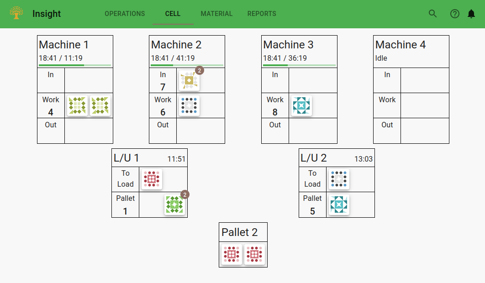
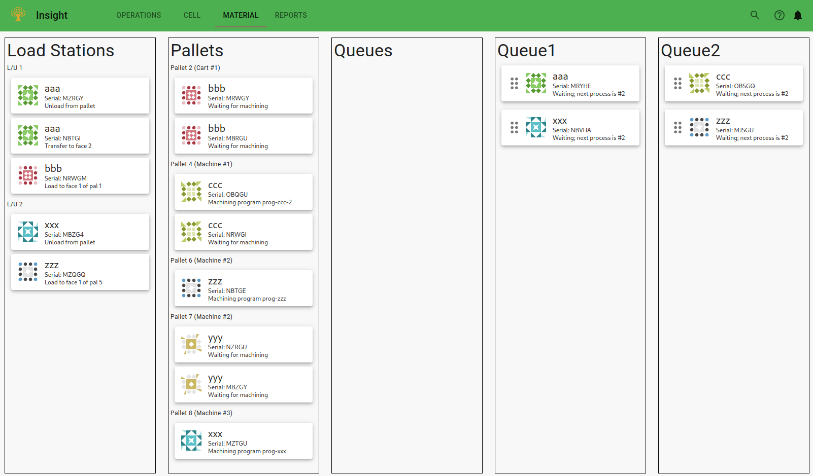
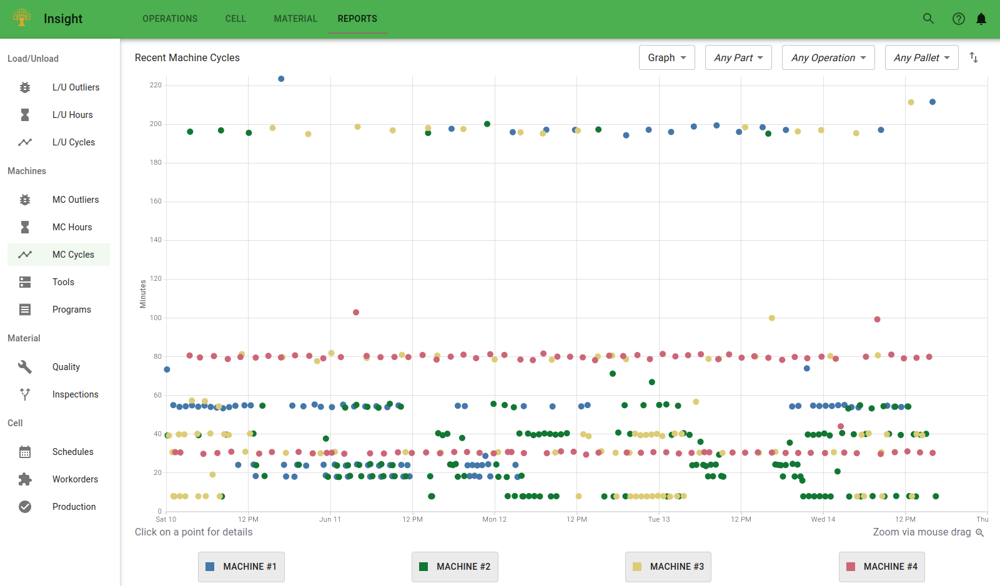

# FMS Insight Cell Operations Pages

The operations pages are intended for the floor supervisor. These pages display information about
the past few days of cell operation and allow the supervisor to keep the cell operating smoothly.
(Anything older than a couple days should not be analyzed on the shop floor the heat of the moment but
instead be addressed in a [monthly review](improve-fms).)

We suggest that the operations dashboard is bookmarked by the supervisor and visited directly.
There are also tabs for monitoring the operators at the load station, the machine cycle times,
and all the material in the system.

## Dashboard

The dashboard shows an overview of the current status of the cell.
The supervisor should keep the dashboard open since it allows at a quick glance to
understand if the cell is running well.

On the top are two progress bars which show the completed parts and simulated
parts for all active schedules. The completed parts progress bar shows actual
completed parts (finished unloading) and counts each process as a separate
completed part. The simulated parts progress bar shows the expected number of
completed parts at the current time based on the simulation. While these two
progress bars likely won't match exactly, they should be close to each other if
the cell is running smoothly. More details about schedules are available on
the _Schedules_ tab.

Below the progress bars is a bar chart of load and machine cycles for the past
12 hours and future 8 hours. The x-axis is the time of day with a vertical
black line for the current time. The y-axis is the load stations and machines.
Each load station or machine shows a green bar for a each actual completed cycle
and a gray bar for each simulated cycle. For machine cycles which are currently
executing or load/unloads in progress, a light-green bar is shown for the
expected remaining time in that cycle.

In addition, if a cycle is a statistical outlier (the cycle is longer than the
expected cycle time), then the portion of the cycle which is beyond the expected
is shown in red. You can therefore gauge at a glance how many cycles have run
long and by how much.

## Cell

The Cell tab shows an overview of the cell. Each machine, load station, and pallet
is displayed with the material currently on the pallets. Each piece of material can be
clicked to open show details about the material. This page is identical to the
system overview pages available on the [shop floor](client-station-monitor).

## Material

The Material tab displays all [virtual whiteboard regions](material-tracking). This includes the regions for all pallets
and all configured in-process queues. It differs from the cell tab in that the material currently in all the queues is also included.

Material can be moved between the various queues by clicking and dragging on the 6-dots on the left of
the material card. Material can only be moved between non-active queues (for example for quarantine or other tracking). Material
cannot be added or removed to active queues currently being used for machining here. Instead, material
must be added or removed on the [shop floor](client-station-monitor) using the Queues page.

## Reports

The Reports tab shows a collection of reports useful for the floor supervisor. These reports focus on the
past few days of operations and highlight places where the cell is performing well or poorly.
More detailed reports are available on the [flexibility analysis page](client-efficiency).
In our experience, the floor supervisor should focus only on keeping the cell running; longer-term analysis
is best done by a one-a-month or once-a-quarter review.

Reports include the data from the [machine engineering page](client-engineering) and similar
reports for the load station, data for [tools and programs](client-tools-programs), reports for
[quality control](client-quality), and more.
