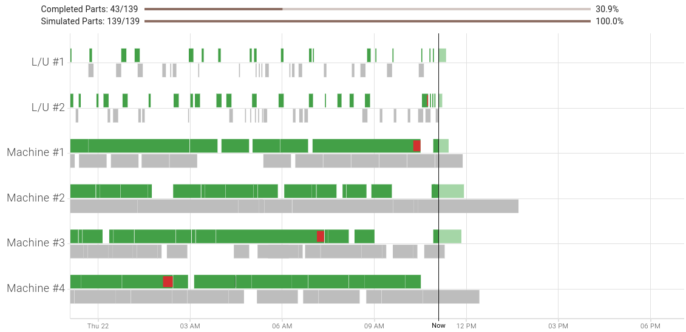

# FMS Insight Cell Operations Pages

The operations pages are intended for the floor supervisor. These pages display information about
the past few days of cell operation and allow the supervisor to keep the cell operating smoothly.
(Anything older than a couple days should not be analyzed on the shop floor the heat of the moment but
instead be addressed in a [monthly review](improve-fms).)

We suggest that the operations dashboard is bookmarked by the supervisor and visited directly.
There are also tabs for monitoring the operators at the load station, the machine cycle times,
and all the material in the system.

## Dashboard

The dashboard shows an overview of the current status of the cell.
The supervisor should keep the dashboard open since it allows at a quick glance to
understand if the cell is running well.

On the top are two progress bars which show the completed parts and simulated
parts for all active schedules. The completed parts progress bar shows actual
completed parts (finished unloading) and counts each process as a separate
completed part. The simulated parts progress bar shows the expected number of
completed parts at the current time based on the simulation. While these two
progress bars likely won't match exactly, they should be close to each other if
the cell is running smoothly. More details about schedules are available on
the _Schedules_ tab.

Below the progress bars is a bar chart of load and machine cycles for the past
12 hours and future 8 hours. The x-axis is the time of day with a vertical
black line for the current time. The y-axis is the load stations and machines.
Each load station or machine shows a green bar for a each actual completed cycle
and a gray bar for each simulated cycle. For machine cycles which are currently
executing or load/unloads in progress, a light-green bar is shown for the
expected remaining time in that cycle.

In addition, if a cycle is a statistical outlier (the cycle is longer than the
expected cycle time), then the portion of the cycle which is beyond the expected
is shown in red. You can therefore gauge at a glance how many cycles have run
long and by how much.

## Load/Unload

The _Load/Unload_ tab allows the supervisor to monitor the operators at the load station.

First, there is a table which shows cycles from the last three days which are
statistical outliers. The outlier detection is based on the [median absolute
deviation of the
median](https://en.wikipedia.org/wiki/Median_absolute_deviation), which is
more resilient to outliers than the standard deviation. There are two reasons that a load/unload
cycle will appear here:

- If the actual time at the load station is far away from the median actual time, the cycle will be displayed. Cycles of this
  type indicate that the load operation took longer than expected.
- If the expected load time from the job is far away from the median actual time, the cycle will be displayed. Cycles of this
  type indicate that the expected time is unrealistic (as long as enough cycles are available to obtain good statistics). In this
  case, the expected load time in the flexibility plan should be adjusted to be equal to the median time. Alternatively,
  perhaps the steps or procedures at the load station should be changed.

Next, the planned and actual load hours for the past 7 days are shown. The
data can be toggled between a bar chart and a table. Anything older than 7
days is available as part of the [monthly review](improve-fms) on the
[flexibility analysis page](client-flexibility-analysis).

Finally, the page contains a chart of all load station cycles from the past 3 days. The chart can
be zoomed by clicking and dragging, filtered to specific parts and/or
pallets, and toggled to a table. Clicking on any point allows more details
about the cycle to be loaded. Again, anything older than 3
days is available as part of the [monthly review](improve-fms) on the
[flexibility analysis page](client-flexibility-analysis).

## Machines

The _Machines_ tab allows the supervisor to monitor the performance of the
machines. It displays identical data as the _Load/Unload_ tab but for
machines instead. First, there are outlier cycles from the last three days
based on the [median absolute deviation of the
median](https://en.wikipedia.org/wiki/Median_absolute_deviation). Next, the
planned and actual machine hours for the past 7 days, and finally a zoom-able
and filterable chart of recent machine cycles.

## Schedules

The _Schedules_ tab shows the supervisor an overview of the scheduled and actual parts produced in the past 7 days.
The table lists all the jobs downloaded from the past seven days together with the quantities of parts in various
stages.

- The _Note_ column allows the user to enter a note for each schedule (does not impact the production in any way,
  just useful as a comment field).
- The _Scheduled_ column shows the original quantity of parts downloaded into the cell controller as part of the job.
- The _Removed_ column shows the count of planned parts that have been removed from the cell controller by an operator
  after the job was downloaded.
- The _Completed_ column shows the count of parts that have been logged to be completed.
- The _In Process_ column shows the count of material currently on pallets or inside in-process queues.
- The _Remaining To Run_ column shows the quantity of parts that the cell controller is currently configured
  to produce.

Note that in an ideal situation these numbers add up properly (scheduled = completed + in-process + remaining),
this does not need to be the case. If parts are scrapped, an operator or supervisor edits the schedules in the
cell controller, or other unplanned changes are made, the quantity of parts in these columns is updated to
reflect the current situation on the shop floor. Thus, this table can be used to provide an overview of the
actual operations as compared to the original planned schedule.

## Material

The Material screen displays all [virtual whiteboard regions](material-tracking). This includes the regions for all pallets
and all configured in-process queues. If [quarantined material](material-quarantine) is enabled (as seen in the
screenshot below), material can be moved between the various quarantine queues by clicking and dragging on the vertical dots
on the material card. In addition, notes can be added to each piece of material by opening the material card.

