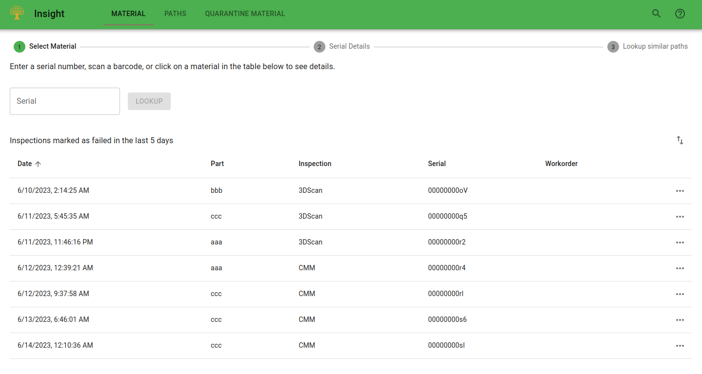
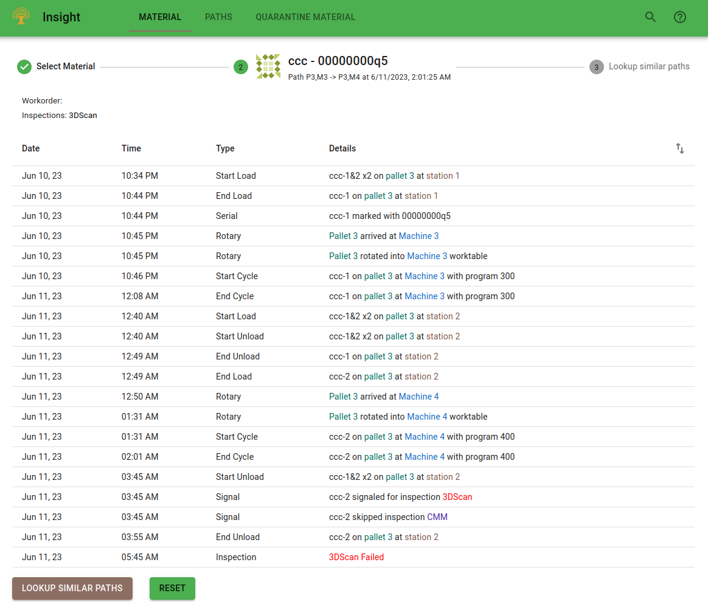
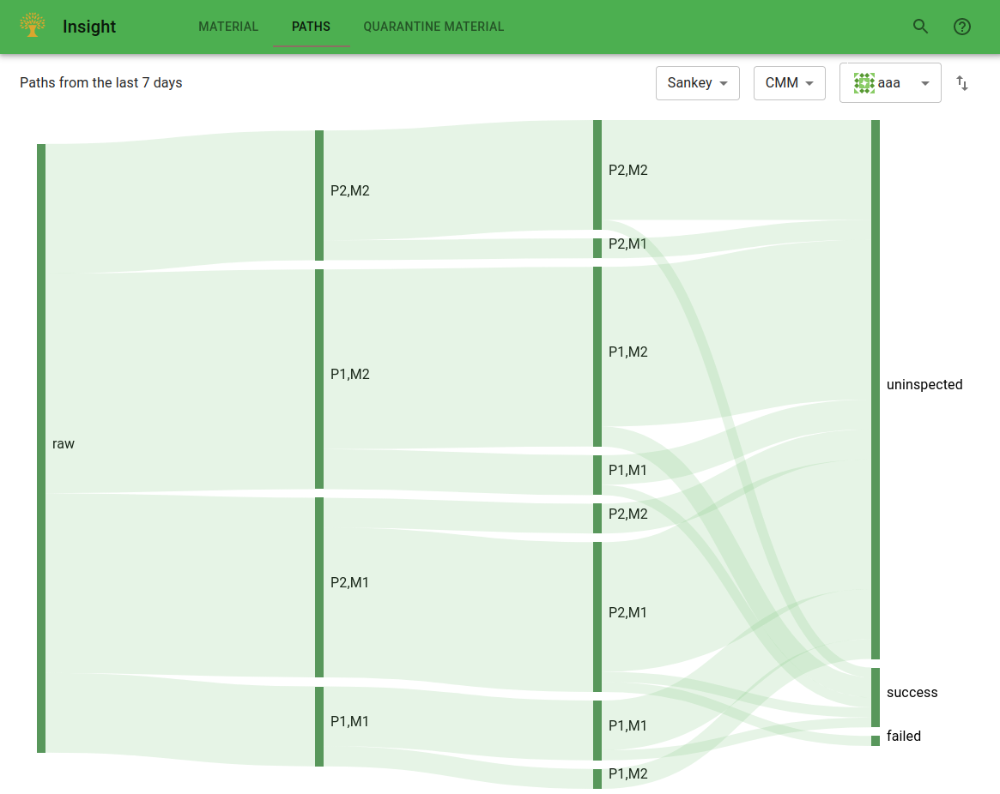

# FMS Insight Quality Pages

The quality analysis page is intended for the quality engineers. These tabs display information about
the past few days of inspections and cell operation and allow the engineers visibility into the cell's operation.
(Anything older than a couple days should not be analyzed in the heat of the moment but
instead be addressed in a [monthly review](improve-fms).)

We suggest that the quality dashboard is bookmarked by the engineers and visited directly.
All data available here is also available in the reports tab of the [operations page](client-operations). The quality
page just provides a dedicated place for engineers to bookmark and visit directly.

## Material

The material tab allows to search or lookup details about a piece of material (typically a piece of material
which failed inspection or failed after being sent out of the cell). The serial can be manually entered,
[scanned](client-scanners), or selected from the list of recent failed serials.

Once selected, the details of the material are displayed. A button at the bottom can then search
for similar paths.

The similar paths are displayed in a table grouped by inspection type and path. The table shows
each path and can be expanded to view the specific serials which followed that path.

## Paths

The _Paths_ tab shows all paths from the last week, grouped by inspection type and part. It shows the data either via
a Sankey chart or a table and shows signaled, succeeded, and failed inspections. It can be used to visualize
the paths that have occurred recently via the Sankey diagram or investigating the paths in detail via the table.
Anything older than 7
days is available as part of the [monthly review](improve-fms) on the
[flexibility analysis page](client-efficiency).

The chart shows a Sankey diagram of the material paths and
inspection results. First, select an inspection type and then select a part
in the top right. FMS Insight then loads all cycles for this part for the
entire month and groups them according to their path (A path consists of a
pallet and machine for each process or sequence, plus the final inspection
result.) The counts of the various paths are then charted using a Sankey
diagram, where the widths of the bars are drawn scaled based on the quantity
of parts which took that path, with parts "flowing" from left to right.
Any link can be moused over to obtain additional information in a tooltip.

For example, in the above screenshot, one path is to use pallet 1 and machine
2 (P1,M2) for the first sequence and then pallet 1 and machine 1 for the
second sequence (P1,M1). This corresponds to the large top link between `raw`
and `P1,M2` and then the downward-curved link between `P1,M2` on the left and
`P1,M1` on the right. The path is then further split with uninspected parts
and successfully inspected parts.

## Quarantine Material

If [quarantined material](material-quarantine) is enabled, this page displays all the quarantined material queues.
Material can be moved between the various quarantine queues by clicking and dragging on the vertical dots
on the material card. In addition, notes can be added to each piece of material by opening the material card.

