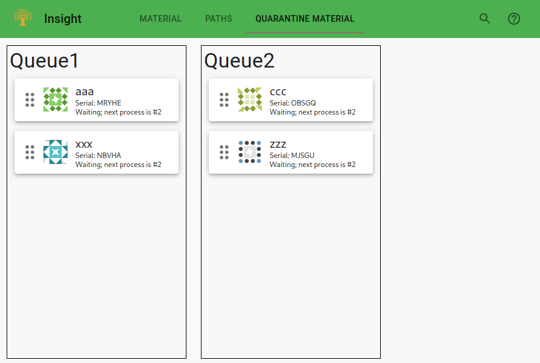

# FMS Insight Quality Pages

The quality analysis page is intended for the quality engineers. These tabs display information about
the past few days of inspections and cell operation and allow the engineers visibility into the cell's operation.
(Anything older than a couple days should not be analyzed in the heat of the moment but
instead be addressed in a [monthly review](improve-fms).)

We suggest that the quality dashboard is bookmarked by the engineers and visited directly.
There is also a tab for searching for parts similar to a failed part and a tab which displays recent
inspections.

## Dashboard

The dashboard is intended to be kept open by the quality engineers to monitor
the cell. It displays all inspections marked as failed in the past 5 days.
(An inspection is marked as failed by an operator on the [inspection station
monitor page](client-station-monitor).) Clicking on the three dots icon
in each row will open more details about the part.

## Failed Part Lookup

The _Failed Part Lookup_ tab allows an engineer to lookup the specific information about a part by serial and also
search for similar paths. This is done in three steps:

1. First, the serial for a part is manually entered or [scanned](client-scanners).

2. The details for this specific serial is loaded and displayed. FMS Insight also extracts the path and time that
   machining completed.

3. Similar paths are displayed. FMS Insight initially searches for all paths for this part within 5 days of the time that
   machining completed. The data is grouped by inspection type and path, allowing other parts signaled for inspections
   to be seen. **In order to see any data, a specific inspection type must be selected!**

Initially, only 5 days around the completed time are loaded (in the above screenshot, the range is from 4/4/2019
to 4/14/2019.) The arrow buttons next to the dates in the bottom right corner can be used to load additional days and
extend the range, to perhaps find more parts.

We suggest copying data to the clipboard and pasting it in a spreadsheet to provide a checklist to quarantine
parts.

## Paths

The _Paths_ tab shows all paths from the last week, grouped by inspection type and part. It shows the data either via
a Sankey chart or a table and shows signaled, succeeded, and failed inspections. It can be used to visualize
the paths that have occurred recently via the Sankey diagram or investigating the paths in detail via the table.
Anything older than 7
days is available as part of the [monthly review](improve-fms) on the
[flexibility analysis page](client-flexibility-analysis).

The chart shows a Sankey diagram of the material paths and
inspection results. First, select an inspection type and then select a part
in the top right. FMS Insight then loads all cycles for this part for the
entire month and groups them according to their path (A path consists of a
pallet and machine for each process or sequence, plus the final inspection
result.) The counts of the various paths are then charted using a Sankey
diagram, where the widths of the bars are drawn scaled based on the quantity
of parts which took that path, with parts "flowing" from left to right.
Any link can be moused over to obtain additional information in a tooltip.

For example, in the above screenshot, one path is to use pallet 1 and machine
2 (P1,M2) for the first sequence and then pallet 1 and machine 1 for the
second sequence (P1,M1). This corresponds to the large top link between `raw`
and `P1,M2` and then the downward-curved link between `P1,M2` on the left and
`P1,M1` on the right. The path is then further split with uninspected parts
and successfully inspected parts.

## Quarantine Material

If [quarantined material](material-quarantine) is enabled, this page displays all the quarantined material queues.
Material can be moved between the various quarantine queues by clicking and dragging on the vertical dots
on the material card. In addition, notes can be added to each piece of material by opening the material card.

