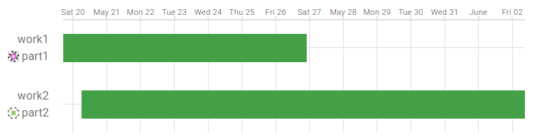

# FMS Insight Sales Pages

The _Sales_ page helps to determine estimates of when existing workorders will
be complete and when available capacity for new orders will become available.
We suggest anyone interested bookmark this page and visit it directly.

## Workorders

The workorders page shows a table of all workorders in the cell, including the
workorder details, the list of parts assigned to the workorder, and the station
utilization for all parts completed by the workorder. Additionally, each
workorder has a list of comments. Comments can be added and viewed by
supervisors, salespeople, or operators on the shop floor. Comments are intended
to be used to communicate information about the workorder between the various
stakeholders.

Depending on the specific configuration of the cell, the _Projected Start_ and
_Projected Filled_ columns may or may not appear. These columns will only appear
if the daily schedules are imported and the daily schedule includes the details
of the simulation. These projected dates are estimates and are calculated only
while running the simulation to determine the daily schedule. Thus, they do not
update throughout the day and will not reflect any changes to workorder
priority, new workorders, completed parts, or any other changes to the cell.
Only once a new simulation is run will the projected dates be updated.

If the daily schedules include the projected start and filled dates, a Gantt
chart can also be shown. The Gantt chart shows the projected start and filled
dates on the x-axis and the workorders on the y-axis.

## Projected Usage

If the daily schedules are imported and the daily schedule includes simulation details,
the projections page will show a calendar of the projected machine utilization of the cell.
Similar to workorders, these dates are estimates and are only calculated while running
the simulation to determine the daily schedule. Thus, they do not update throughout the day.

Each day in the calendar shows the projected machine utilization for that day as a color,
with darker colors showing higher utilization. The day can be hovered to see the exact
projected utilization. This utilization is the simulated machine utilization to complete
all the remaining workorders.

The intention of this report is to allow salespeople to determine when capacity will be
available for a new order. For example, in the screenshot above, the existing workorders
keep the cell busy until mid-August so new workorders should be expected to be filled by
mid to late August. Of course, this is only an estimate and if the priorities of workorders
change, a new workorder could be entered to run before existing workorders.
