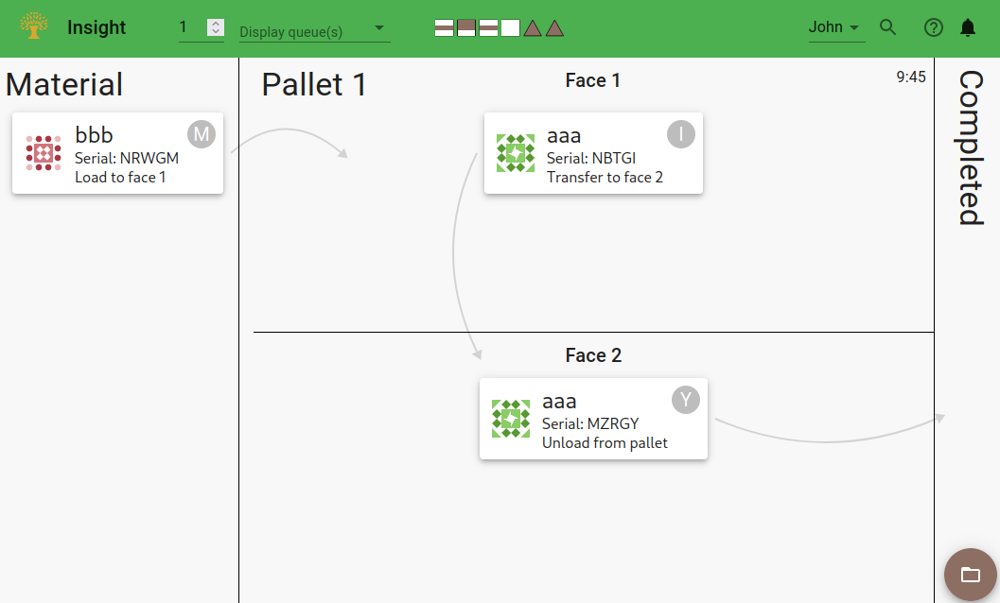

# FMS Insight Station Monitor Pages

The station monitor pages are intended to be used on the shop floor by the operators;
these pages display the [virtual whiteboard of material
sticky notes](material-tracking). Each in-process piece of material is
represented by a virtual sticky note. On the sticky note, FMS Insight
displays the part name, serial, assigned workorder, and any signaled
inspections. The sticky note can be clicked or tapped to open a dialog with
more details about the material including the log of events. The dialog also
allows the operator to notify Insight of changes in the material, such as
completing wash or assigning a workorder. Finally, the sticky note contains
an identicon based on the part name and the final number/letter of the
serial.

We suggest that computers or mounted tablets be placed next to various stations
in the factory, perhaps with an attached barcode scanner.
The computer or mounted tablet can then be configured to open the specific screen
for the station by either bookmarking the page or just setting the specific page
as the homepage for the browser.

## System Overview

In the top bar of every station screen, there is a collection of squares and triangles.
This provides a quick overview of the current state of the system. There is one square for each machine and one
triangle for each load station. The colors within the squares indicate if a pallet is at the inbound, worktable,
or outbound position of each machine. The color within the triangle indicates if the load station is occupied or not.
The icons can be clicked to open up a dialog containing more details about the system overview.

The overview shows each machine, load station and pallet in the system and the material currently on the pallets.
The material can be hovered and clicked to open more details.

## Load Station

On the top toolbar, the specific load station number is set. Insight will display
only regions relevant to this specific load station, including the material region,
the faces of the pallet currently at the load station, and a region for completed material.
Optionally, the queues dropdown on the top toolbar can be used to add additional
whiteboard regions to display in addition to the pallet regions. Typically we suggest that
in-process queues have their own computer with a dedicated display, but for queues closely
associated with the load station such as a transfer stand, the virtual whiteboard region for
the queue can be displayed along with the pallet regions.

When a material sticky note is clicked or tapped, a dialog will open with a
log of events for the piece of material. The dialog can also be opened by
[using a scanner](client-scanners) or manually entering a serial via the
magnifying glass button on the toolbar. In the dialog, a variety of actions
can be taken for the specific material.

Finally, the lower-right hand corner of the screen contains a brown circular button which when
clicked will open all load instructions for all material currently being loaded or unloaded.
Alternatively, in the material dialog, the Instructions button can be clicked to open the instructions
for only a single piece of material.

## Queues

The queues screen shows the material currently inside one or more queues. On the top toolbar,
one or more queues can be selected and the virtual whiteboard regions for the selected queues
are then displayed. The material in the queue can be re-ordered by clicking and dragging on the
6-dot icon on the left of each piece of material. Depending on the configuration and
which specific queue is selected, material can be added to a queue by clicking the plus icon
in the top-right corner.

On raw material queues, the list of in-process jobs and/or unfilled workorders will be displayed
in a table. This table can be used by the operators to decide which material to run next.

By clicking or tapping on a material sticky note, a dialog will open with
details about the specific piece of material. The dialog will have a variety of
actions for the specific material. An attached [barcode scanner](client-scanners) can
also be used to open the material dialog.

## Inspection

The inspection screen shows completed material that has been marked for inspection. On the top
toolbar, a specific inspection type can be selected or all material for inspection can be shown.
On the left is the virtual whiteboard region for completed but not yet inspected material and on
the right is material which has completed inspections.

When a material sticky note is clicked or tapped, a dialog will open with a
log of events for the piece of material. If a specific inspection type is
selected, there will be buttons to mark a piece of material as either
successfully inspected or failed. When clicked or tapped, this will record an
event in the log and move the virtual sticky note from the left to the right.
The top toolbar on the right allows an operator name to be entered and this
operator name will be attached to the created inspection completed log entry.
Finally, the operator can open [inspection instructions](part-instructions).

An attached [barcode scanner](client-scanners) can also be used to open the material
dialog. This allows viewing details and marking as inspected or uninspected
any part by scanned serial (even if the part is not on the screen).

## Close Out

The close out screen shows completed material from the last 36 hours. On the left
is the virtual whiteboard region for completed but not yet closed out material
and on the right is material which has completed closeout.
Closeout is optional but intended for any final manual process needed before the
part can be shipped; typically this includes a final wash or workorder assignment or
other tasks.

When a material sticky note is clicked or tapped, a dialog will open with a
log of events for the piece of material. There is a button to mark a piece of
material as closed out. When clicked or tapped, this will record an
event in the log and move the virtual sticky note from the left to the right.
The top toolbar on the right allows an operator name to be entered and this
operator name will be attached to the created log entry.
Finally, the operator can open [instructions](part-instructions).

An attached [barcode scanner](client-scanners) can also be used to open the material
dialog. This allows viewing details and marking as closed out
any part by scanned serial (even if the part is not on the screen because more than 36 hours has passed).

## System Overview Page

All station screens have access to the system overview by clicking the system overview button
(the colored squares and triangles) located in the top toolbar which opens the system overview in a dialog.
Alternatively, the system overview can be opened as a dedicated page itself. The intention of FMS Insight
is that each tablet or computer be dedicated to a specific task or station, and thus you may consider a
dedicated display for the system overview page. (Note, the system overview is also available to the operations
manager as part of the [Operations Screens](client-operations).)

The system overview shows all the machines, load stations, and pallets. It also shows the material on each pallet.
The material can be clicked to bring up the details for that specific piece of material.
