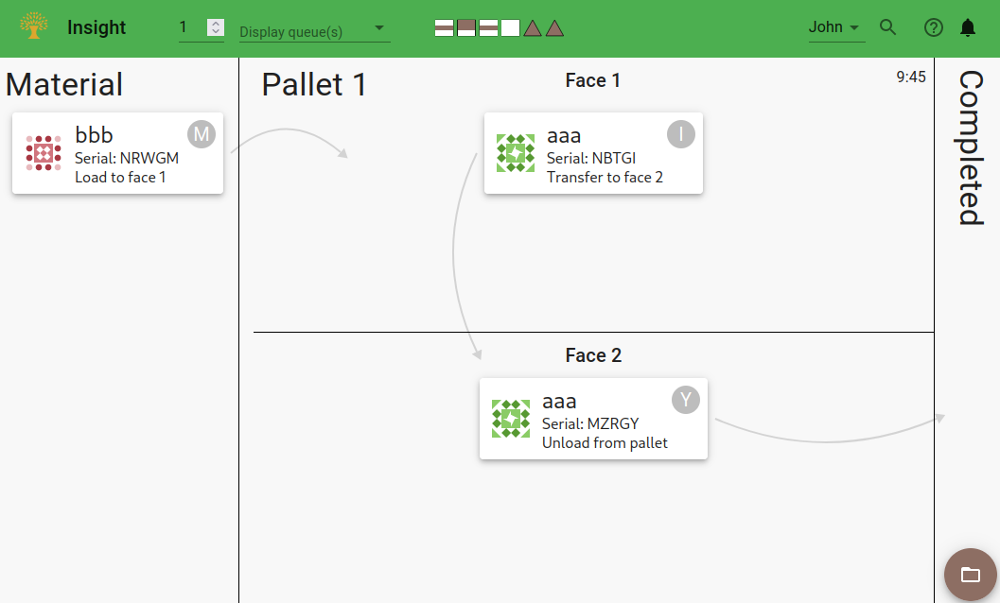
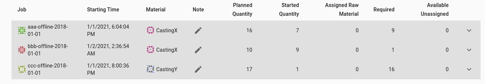

# Load/Unload Procedures

FMS Insight provides [targeted pages](client-station-monitor) for operators on the factory floor:
a page for each load station which shows the material to load or unload, a page for each inspection stand
showing details about the material to be inspected, a page for the wash station, and finally a page
for in-process material queue management. These pages use the [whiteboard metaphor](material-tracking)
for material tracking. We suggest that each station has a dedicated display or tablet with the relevant page
bookmarked or made the homepage; these pages are designed to work on a touchscreen. In addition, each station
should have an attached barcode scanner.

FMS Insight's load station page will display what the cell controller
is expecting to happen at the load station. Specifically, the page will display the material
to load, the material to unload, and the material to transfer between faces (if the pallet has
multiple faces). If the operator performs all the tasks as specified, the operator presses
the load button to signal to the cell controller that the load is complete. FMS Insight monitors
the cell controller and will update the page.

If queues are used for managing material, the load station screen also can show the queues on the
right hand side. The specific material that is marked as loaded is the first material in the queue
which matches the job and route details. The material in the queue can be re-ordered by dragging,
which allows the operator to control which serial is loaded onto the pallet. Note that because
the cell controller has already assigned a job to the pallet at the load station, the material
at the front of the queue will not always be the material that is loaded; the first material which
matches the job is loaded.

## Introducing Raw Material

The jobs control how raw material is introduced. If no raw
material queue is set on the job, the cell controller will assume that raw material is
always available and bring a pallet to be loaded as soon as it is empty. FMS Insight is watching
the cell controller and will create new material once the load is complete.

Alternatively, the job can be configured with an input queue on the first process. In this case,
the contents of the queue control when the cell controller will bring a pallet to the load
station to be loaded. The Queues webpage shows the contents of the queue and allows the operator
to scan or enter new material into the queue. The page also shows a table of scheduled jobs and
shows the quantity of parts that still must be loaded.

The operator should physically bring the casting/raw material to the cell and place it in
a designated area nearby the load station. Once the material has arrived, the operator
can click a button on the queues webpage (or scan a barcode) to add the material to the queue.
FMS Insight supports a variety of techniques controlled by [config settings](server-config):
adding raw material assigned to a specific job, adding raw material with or without a serial,
or bulk adding a large quantity of material.

Each physical location on the shop floor which holds material should coorespond to a queue
in FMS Insight. In addition, each queue should have a dedicated display or tablet mounted
on the shop floor right next to the queue. This display should have the queues page
bookmarked or set as the homepage and only show the queues page. This allows the operators
and supervisors to quickly check at a glance that the material on the shop floor matches
the material FMS Insight records as in the queue.

## Quarantine Material

FMS Insight optionally supports the ability to [quarantine material](material-quarantine).
Quarantined material is material that is temporarily removed from the cell for re-machining,
more detailed inspection, or some other rework. Material can be quarantined on the queues
page by opening the material dialog and clicking a button. This moves the material to
the quarantine queue where it is visible on the supervisor's material page.

Once the material is ready to be re-introduced into the cell, the operator should bring it
back to the shop floor. Once the material has arrived, the operator can click a button on
the queues webpage (or scan the barcode) to add the material into the queue. Once it is
back in the queue, the cell controller will activate a pallet to load the material.

## Recovering From Misload

The load station page displays the load, unload, or reclamp steps that the cell
controller is expecting the operator to preform. When the operator presses the ready button,
both the cell controller and FMS Insight (which is watching the cell controller) assumes
that these instructions took place. FMS Insight will take the material from the input queue
and record it as loaded onto the pallet. The cell controller will begin moving the pallet
to the machine.

If for whatever reason the load instructions can not be followed, idealy the operator should
edit the cell controller **before** the load is completed. FMS Insight will adjust itself
based on whatever the cell controller expects to happen and only at the time that the load
is completed is anything finalized and recorded.

If the load button is pressed, the first step is to adjust the status in the cell controller
to match what actually happened. FMS Insight is watching the cell controller and when
the pallet status is adjusted, FMS Insight will move any material that was thought to
be loaded on the pallet to the quarantine queue. That material can then be re-introduced
back into the queue so that the queue in FMS Insight matches the material on the shop floor.
In addition, FMS Insight allows the ability to invalidate the inadvertant load events that
were created.

Finally, in certian situations depending on the specific configuration of the jobs and queues,
FMS Insight supports a serial swap. FMS Insight assumes the material that is loaded is the
first material in the queue which matches the job the cell controller expects.
If the serial actually loaded is different but the job and detials match, the supervisor can
swap the two serials on the supervisor's material page. This is a data-only change and no
change is made to the cell controller. If a swap cannot be performed, the material must be
quarantined and invalidated as described above.
