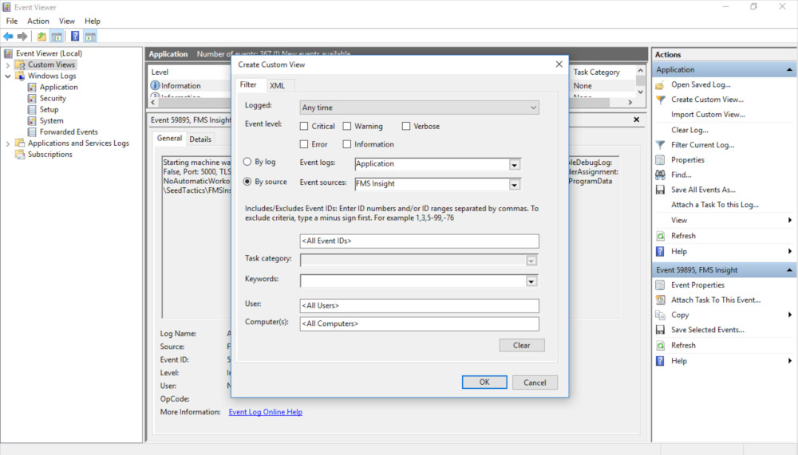

When the FMS Insight server encounters an error, it reports the error back over the network to the
software that requested the operation (such as the Insight client web page).  The FMS Insight server
also logs the error with more details into the Windows Event Log.  Thus, when the Insight web page or
any other software reports an error you can check the Windows Event Log on the cell controller
for more information.

## Windows Event Viewer

 The location of the viewer is different in different versions of Windows;
on Windows 10, open the start menu and search for "Event Viewer" and on Windows 7 open the "Control Panel",
navigate to "Administrative Tools", and then open the "Event Viewer". To view the events in the event viewer,
navigate to "Windows Logs" and then "Application" in the tree on the left (see the screenshot below).

The windows event viewer shows events from all applications.  FMS Insight generates events "FMS Insight"
as the event source, which allows you to create a custom view to filter only the events from FMS Insight.
To do so, go to the action menu, click "Create Custom View", and fill in "FMS Insight" as the event source
(see the screenshot below).

## Debug Log

To assist with debugging, FMS Insight has the ability to output a trace of
activity with events for almost all actions that FMS Insight takes. The debug
trace is disabled by default because it generates a lot of data. To enable
it, edit the [config file](server-config.md) and change the setting
"EnableDebugLog" to true. The FMS Insight server must be restarted before the
config setting takes effect. The debug trace log will be generated into the
global AppData folder, which defaults to `c:\ProgramData\SeedTactics\FMSInsight`.
The debug trace files are named `fmsinsight-debug.txt`, there will be one file
per day, and the file is JSON formatted. Remember to disable the trace log after
a day or two because it generates a lot of data.